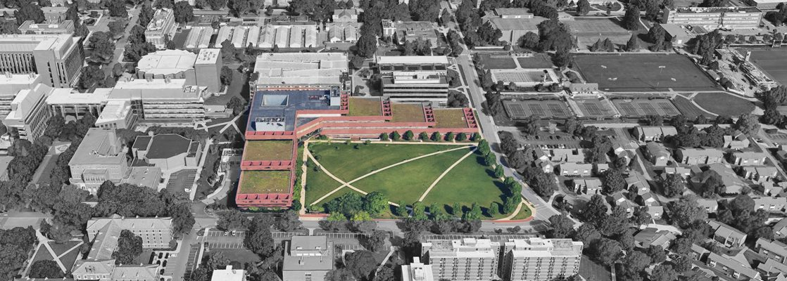
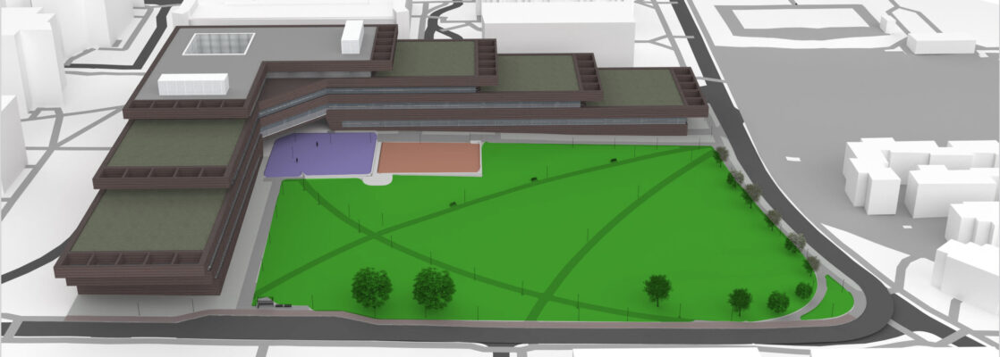

# Planting Goals, Objectives, & Program {#sec-program}

{#fig-MSC_Site fig-alt="Aerial view of the Millennium Science Complex site showing the building highlighted in color and a large adjacent lawn outlined as the project area, surrounded by campus buildings, trees, streets, parking, and athletic fields." fig-align="center" width=100%}

## Millennium Science Complex (MSC) project site
LArch 335+837 Planting Methods comprises a semester-long, multi-module project. Our project site this semester is the Millennium Science Complex (MSC) landscape situated at the northwesterly corner of Pollock and Bigler Roads. The MSC site is currently a minimally planted turfed “plateau” landscape and a few transecting paths framed along the north and west margins by the MSC building, designed by renowned architect Rafael Viñoly. Completed in 2011, the 275,600-square-foot building is one of the nation’s first buildings specifically constructed to support the integration of the physical and life sciences. This convergence of engineering, physical science, and life sciences opens new frontiers in human health, energy, and materials science. The facility houses two of the University’s premier research organizations: the Materials Research Institute (north wing) and The Huck Institutes for the Life Sciences (west wing).

More than just a collection of laboratories and instruments, the MSC embodies a new style of research in which experts from many disciplines coordinate their technologies and knowledge in ways that produce exponential advances. It also has an ornate deck garden (research facilities are below) northwest of the complex that’s immediately accessible to our site via a soaring breezeway. There are 60,000 sq. ft. of green roofs on five terraces.

Since the current outdoor environment of the ‘front’ landscape is unremarkable and falls well short of ecological, aesthetic, socio-functional, and didactic potentials, we will assume that Penn State is ready to invest in planting and sustainable landscape management that more effectively serves the university’s broad mission. We will focus on sustainability, people-plant interactions, and the applied life sciences.

## Goals
**The overall goal** for the Millennium Science Complex (MSC) project site is to create a cohesive, inspiring, accommodating, resilient, sustainable, inclusive, and informative landscape that thrives over time. Specifically, your strategies should result in a planted landscape that meets the following objectives:

- inspirational and captivating through all seasons;
- sustainable: contributes to the sites’ ecological and hydrological health, and flourishes with a minimum of resource inputs (e.g., energy, chemicals, water); meadow installation, in particular, will embrace species diversity and be adaptively managed rather than meticulously maintained;
- inclusive: fully and equally welcoming to all kinds of people and individuals;
- didactic: provides opportunities for on-site group and individual learning and research about plants and the ecosystems that sustain them through time;
- functional and safe: promotes spatial organization and accommodates pedestrian circulation, social meeting, and security needs.

## Program for project planting areas
This year, LArch 335+837 will address three key planting types: a mixed pollinator garden, a treed terraced plaza, and a planted meadow ecosystem. All are located on the MSC site (see the image below for locations). In their ways, each of the three interrelated project sites will promote the aesthetic, ecological, and inclusivity, educational, and utilitarian/practical objectives stated above.

***Image Legend:***

Tan = Module 2: Mixed Pollinator Garden

Purple = Module 3: The Treed Plaza

Light Green = Module 4: Planted Meadow Ecosystem Meadow

{#fig-MSC_Site_Design fig-alt="Site diagram of the Millennium Science Complex showing three color-coded planting areas beside the building and adjacent lawn: tan for Module 2, a mixed pollinator garden; purple for Module 3, the treed plaza; and light green for Module 4, the planted meadow ecosystem." fig-align="center" width=100%}

## Mixed Pollinator Garden (Module 2)
The mixed pollinator garden is a garden that blends the two key goals: creating pollinator habitat and aesthetic appreciation. We will adapt influences from the conventional layered “mixed bed” genre that stimulates the senses and welcomes all users as they negotiate garden entry portals near the nexus of the MSC north and west wings. In balancing ecological and aesthetic goals, you must consider plant phenology, co-adapted pollinator species, and related full life-cycle factors with aesthetic factors such as overall harmony, balanced and variety as well as details such as texture, color, sequence, etc. to achieve sensory and emotional interest in your garden orchestrations.

Your palette should include a few select native small trees and shrub clusters, and then focus on diverse, colorful and interesting native herbaceous perennials. Be aware of sun/shade patterns as you strategically locate larger woody plants – most herbaceous perennials flourish best in full sunlight. Some degree of layering is vital in creating visual cohesion, depth and varying botanical micro-climates. Careful orchestration of accent and massed plants that respond to user circulation and viewing, as well as adjacent built forms, is essential to achieving a compelling and holistic pollinator garden planting. The inclusion of one or several seating spots is a final requirement.

## The Treed Plaza (Module 3)
The treed plaza is an urbane contrast to the Mixed Pollinator Garden and Planted Meadow Ecosystem. It offers shade trees in the designated terraced plaza, demonstrating best practices for tree plantings in urban hardscapes. As importantly, it provides a pleasant seating environment for socialization or individual relaxation in the area leading to, and between, both MSC wings and the associated breezeway, while accommodating filtered pedestrian circulation. We expect you to research and select 2-3 tree improved cultivars (native or introduced) that are appropriate to the urban context represented in the two terraces.`

Several approaches for installing plaza paving over substantial below-grade soil in the root zone will be addressed (you will choose at least two). Within five years after installation trees should achieve continuous (70-80%) dappled shade throughout the plaza area. Since our technical learning focus is on the thoughtful assemblage of healthy shade trees within an urban hard surface context, you should develop an inviting and functional orchestration of trees, modular paving, and seating accommodations.

## The Planted Meadow Ecosystem (Module 4)
The planted meadow ecosystem is an herbaceous community that will replace the MSC turf plateau that demonstrates graminoids (i.e., grass and grass-like species) and forbs (i.e., perennial wildflowers). This largely self-sustaining plant community will serve as a learning environment for students, faculty, staff and visitors to explore meadow ecology and establishment techniques. As importantly, it should also be a pleasant place to experience a richly textured and colorful setting close at hand. And, last but not least, it should function effectively as habitat for pollinators and other small and benign native animals, as appropriate.

Total meadow coverage should be about 80-90% of the MSC plateau, with the remainder for paths and a small amount of sustainable turf for lolling in the sun. The Module 4 problem statement will also call for a small “rain meadow” (aka, rain garden) area in the lower elevation of the plateau, necessitating its own specialized seed mix of FACW cool-season grasses and related forbs.

Your meadow concept should respond to the soils on site, and keep microclimatic, landform, ecological, educational, social inclusion, and aesthetic considerations in mind. Ensure that your meadow is positioned to receive lots of sunlight. Your species palette and design should reflect a type of meadow habitat, or larger grassland ecosystem, that will thrive in our central Pennsylvania valley upland context. Grasses will form the backbone of the meadow (60-80% of herbaceous cover), since wildflower-only plantings tend to get spindly, become weedy, and succeed into grassy fields in any case.

Two primary categories of grasses tend to dominate natural grasslands:  warm-season grasses in the Midwest U.S., and cool-season grasses in the Northeast U.S. Generally, cool-season grass meadows are easier to establish than warm-season grass meadows (also called “tallgrass prairie”). Thus, you must design and prepare CDs for all three types of meadows noted above: a warm-season grass meadow, a cool-season grass meadow, and a rain meadow. Variations within each of the 3 is up to you, and is encouraged. Native species should predominate in your seed mix, but well-reasoned, non-aggressive introduced species and cultivars may find a place in the cool-season grass meadow

You should ensure that users can access the meadow interior via resilient permeable pathway surfacing to accommodate a sense of immersion. Creation of interpreted habitat for native fauna (especially pollinators) is encouraged.

For the warm-season grass meadow, you may choose one of two distinct establishment regimes: a specialized mowing technique, or periodic controlled burns. If you chose to burn, make sure there are substantial firebreaks (wide sidewalks, grade changes, etc.). We will discuss management approaches and safety precautions at greater length during Module 4.

Finally, it is important that you understand the meadow as a deliberately constructed, intensified representation of the more extensive, regional indigenous plant communities that inspired them. What will begin as plant assemblage will, hopefully in time, become a largely self-sufficient habitat that only requires periodic, adaptive management (“enlightened tinkering”) informed through regular monitoring.