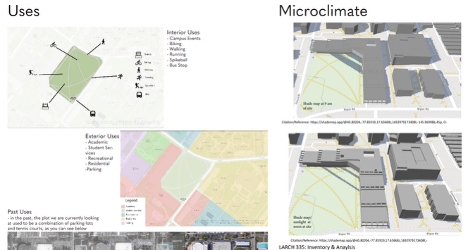

# Module 1: Site Analyses

## Assignment Statement

{#fig-example_journal_entry fig-alt="Presentation slide for a site inventory and analysis divided into Uses and Microclimate. The Uses section features a diagram of on-site activities (such as walking, biking, and campus events), a color-coded map of surrounding land uses (academic, residential, and recreational), and a note that the site was formerly used for parking and tennis courts. The Microclimate section displays two 3D models illustrating the building shadows cast on the site at 9:00 a.m. and noon." fig-align="center" width=100%}

### Overview

#### Point Value
10 points

#### Submissions

Note: Due dates are documented within the [course schedule](02_schedule.qmd). 

- Presentation (PowerPoint)

### Introduction
A site analysis assesses a site’s physical, biological, social, and cultural attributes. It helps identify the opportunities and constraints for a specific site program. Therefore, a site analysis is a **diagnostic process**, not just descriptive mapping. This process begins with a thorough **inventory** of the site’s physical, biological, cultural, and experiential attributes, including the immediate context. The inventory not only provides the information necessary for proper analysis but also a mechanism for becoming familiar with the site in detail before you start designing.

**Analysis** occurs when site and context attributes and the **program requirements** (see @sec-program) are compared to determine the site’s opportunities and issues. Analysis requires going beyond a descriptive inventory to draw **conclusions** about the potential impact (good, bad, or intriguing) of site attributes on the site’s programming and design. This information is presented through a compilation of plans, visuals, and brief text. **Although it may have a “loose” graphic style, it should be well-organized and neatly drawn.** It should also include annotated site photographs keyed to the plan to help the reader visualize and explain the analysis, graphics, and conclusions.

### Submission requirements
Each group (listed on Canvas) will complete composite site inventory and analysis drawings using the Millennium Science Complex (MSC) base plan (provided in Canvas), the given program, and the inventory checklist in @tbl-ia_checklist. While much of the inventory can be mapped in plan view, some non-spatial data may require charts, diagrams, tables, and photographs. Creativity is needed when mixing and matching compatible themes, so you don’t end up with too many slides or an overwhelming amount of information. Ensure that “Inventory” and “Opportunities & Issues” are clearly distinguished on the slides.

Each group will prepare a **10-minute presentation** (approximately 15-30 slides). Submit your presentation as a powerpoint file to the Canvas Assignment Dropbox. No plots are necessary; have your file ready for presentation on the scheduled date (see course calendar). Map scales will vary depending on the topic. Setting up a standard sheet template with consistent columns/gutters for logical board organization is wise. Digital or scanned freehand is fine. Include appropriate titles, labels, and note blocks. Remember to include legends, north arrows, graphic scales, student names, class #, and dates.

To adhere to our tight schedule, we suggest two presenters/groups. Each group should have a powerpoint file (or a similar document) ready for easy access during the class session. One person from each group should submit the group’s powerpoint to the Canvas drop folder by the end of the day on the scheduled due date.

| Category                       | Resources                                      |
|:-------------------------------|:-----------------------------------------------|
| ***Biophysical***              |                                                |
| *Topography*                   |                                                |
| Slope                          |                                                |
| Elevation                      |                                                |
| Orientation (aspect)           |                                                |
| *Drainage*                     |                                                |
| HP and LP                      |                                                |
| Pattern and flow direction     |                                                |
| Off-site flow (watershed context)|                                              |
| *Microclimate*                 |                                                |
| Sun/shade                      |                                                |
| Prevailing winds               | <a href="https://mesonet.agron.iastate.edu/sites/dyn_windrose.phtml?station=UNV&network=PA_ASOS&bin0=2&bin1=5&bin2=7&bin3=10&bin4=15&bin5=20&conv=from&units=mph&nsector=36&fmt=png&dpi=100&year1=2023&month1=1&day1=1&hour1=0&minute1=0&year2=2023&month2=8&day2=23&hour2=0&minute2=0" target="_blank">Windroses</a> |
| Microclimate wind effects      | <a href="https://www.youtube.com/watch?v=xU7i4FcLS_E" target="_blank">Windflow and Venturi effect video</a> |
| Site-specific microclimate     |                                                |
| *Soil Type and conditions*     |                                                |
| Soil texture                   | <a href="https://www.youtube.com/watch?v=ahY5qZwaY1E" target="_blank">Soil texture feel text video</a> |
| Soil texture PDF               | <a href="https://tflohr.com/wp-content/uploads/2024/08/PM_Soil_texture_by_feel.pdf" target="_blank">Soil texture PDF</a> |
| Soil compaction                | <a href="https://tflohr.com/wp-content/uploads/2024/08/PM_Penetrometer_article.pdf" target="_blank">Soil penetrometer  instructions</a> |
| USDA web soil survey           | <a href="https://websoilsurvey.nrcs.usda.gov/app/WebSoilSurvey.aspx" target="_blank">Web soil survey</a> |
| *Vegetation, veg. condition*   |                                                |
| *Habitat*                      |                                                |
| Types                          |                                                |
| Condition                      |                                                |
| Species                        |                                                |
| *Local Context*                |                                                |
| Vegetation                     |                                                |
| Penn State Trees               | <a href="https://psu-opp.maps.arcgis.com/apps/webappviewer/index.html?id=accaa2c563cb4141b76c7c76c7dec370" target="_blank">Trees of Penn State</a> | 
| 
| Habitat and possible wildlife  | <a href="https://www.google.com/url?sa=t&rct=j&q=&esrc=s&source=web&cd=&ved=2ahUKEwjwgI-xn_WAAxVPmGoFHSxJBLkQFnoECBEQAQ&url=https%3A%2F%2Fwww.naturalheritage.state.pa.us%2Fcnai_pdfs%2Fcentre%2520county%2520nhi%25202002-web.pdf&usg=AOvVaw0wrPNmgfdnho2I9NY6sQY-&opi=89978449" target="_blank">Centre County Natural Heritage Inventory, 2002</a> |
| Ecological concepts  | <a href="https://tflohr.com/wp-content/uploads/2024/08/PM_landscape_ecology_principles.pdf" target="_blank">Landscape Ecology Principals</a> |
| PA Pollinators  | <a href="https://pollinators.psu.edu/pennsylvanias-pollinators" target="_blank">Pollinators of PA references</a> |
|***Sensory Qualities & Spatial Impacts*** |                                      |
| Spatial volumes, masses, enclosures, nested spaces; compression & release; spatial ‘leakage’|         |
| Views, noise, odors, textures, colors (include views from buildings)|           |
| “Gestalt” (feel) of the site as a place |                                       |
| Cultural/Infrastructural       |                                                |
| *Uses*                         |                                                |
| Type: On-site                  |                                                |
| Type: Off-site / nearby        |                                                |
| Current / historic             |                                                |
| *Architecture & Structures*    |                                                |
| Interior Activities/Programs   |                                                |
| Form                           |                                                |
| Materials                      |                                                |
| Height                         |                                                |
| Orientation                    |                                                |
| Exterior walls, stairs, terraces, views |                                       |
| Rooftops/green roofs           |                                                |
| *Vehicular Circulation (Including bikes)* |                                     |
| Routes                         |                                                |
| Hierarchy and volume           |                                                |
| Entry/exit                     |                                                |
| Intersections                  |                                                |
| Parking                        |                                                |
| *Pedestrian Circulation*       |                                                |
| Routes                         |                                                |
| Hierarchy and volume           |                                                |
| Entry/exit                     |                                                |
| Intersections                  |                                                |
| Materials                      |                                                |
| *Utilities*                    |                                                |
| Lighting; overhead lines       |                                                |
| Storm Drains (pipes, inlets, etc.) |                                            |
| Steam line?                    |                                                |
| Below-ground stormwater reservoir |                                             |
| other                          |                                                |

: Inventory and analyses checklist. {#tbl-ia_checklist}

### Evaluation Rubric
The details of the evaluation rubric are presented in @tbl-mod1_eval. 

| Description                        | Value            |
|:-----------------------------------|:-----------------|
| *Content*                          |                  |
| All appropriate site and context attributes (see Checklist) are inventoried.| 2.5 points |
| Analytical conclusions, including opportunities, constraints, and implications for the stated program, are complete and thoughtful | 2.5 points |
| *Communication*                    |                  |
|Slides are well organized, visuals are appropriate and well drawn | 2 points |
| Writing is articulate, legible, and succinct | 2 points                     |
| The overall composition and graphic design are appealing and clear | 1 point |

: Module 1 evaluation rubric. {#tbl-mod1_eval}