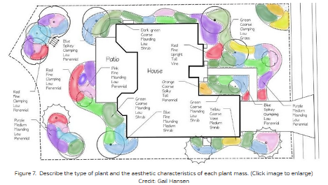

# Module 2a: Pollinator Garden Plant List/Design Check-off

## Assignment Statement

{#fig-example_journal_entry fig-alt="Conceptual landscape planting plan showing a house and patio surrounded by colored, organic shapes representing plant masses. Instead of specific plant species, leader lines annotate each mass with its intended aesthetic and physical traits, listing color, texture, form, size, and plant type (for example, Red, Fine, Clumping, Low, Perennial or Green, Coarse, Mounding, Low, Shrub)." fig-align="center" width=100%}

### Overview

#### Point Value
15 points

#### Submissions

Note: Due dates are documented within the [course schedule](02_schedule.qmd). 

- One PDF containing two pages, with one conceptual sketch per page.

### Introduction
Now that you have analyzed the Millennium Science Complex site and its contexts, you can test your design abilities by building a plant palette and creating a design for a mixed pollinator garden. Designing at an intimate scale, you will explore how native plant assemblages and individual plants can serve both humans and pollinators. 

To stimulate ideas for this garden, take advantage of observations from the analysis assignment, lectures, the references we have suggested, and your personal experiences. You will assemble a native plant palette that considers overall plant forms and the organization of a layered mixed garden (in plan view) while exploring individual and massed plant forms, textures, colors, seasonality/phenology, and biodiversity. As you grapple with the complexities of plant selection, strive for a blending of **ecological** (e.g., productivity, flexibility, contextuality, inclusive of complete pollinator life cycles, etc.) and **aesthetic** (e.g., spatial definition, harmony, proportion, balance, varied sensory interest, functionality, etc.) objectives in your choices. 

#### Plant Choreography
Your pollinator garden will rely on **a layered choreography** of plant forms to promote a range of positive human impacts (aesthetics, educational, etc.) on the one hand, while accommodating pollinator community needs throughout the year on the other. This will often (though not necessarily) progress from taller forms at the rear to lower layers near pathways and interaction points. However, you must also consider plan-view arrangements, such as microclimatic influences on human and plant/pollinator life in the garden. 

Most herbaceous perennials of interest to pollinators thrive best in full sun, suggesting that you consider the garden’s north-south axis when negotiating the adjacencies between smaller and larger plant forms. Humans usually also appreciate a range of choices when walking through and relaxing in gardens, from full sun to dappled shade to deep shade. Place one or more small ornamental trees near seating; the trees should be located several feet to the south/southwest of the bench to provide shade during hot weather. Finally, consider views from inside the MSC North and West wings, as well as from the adjacent plaza terraces.

#### Herbaceous and Woody Plants
	
Flowering native herbaceous plants^[We will use the industry convention of ‘perennial’ to connote herbaceous perennial plants while acknowledging that woody plants are also technically perennial – they’re just not herbaceous.] are vital to pollinator garden success, so these ‘herbs’ will comprise most of your planting palette. For low-lying swaths of interplanted herbaceous perennials, include a few upright accents of herbaceous perennials, grasses, or ferns for visual interest. Grasses help balance the ecosystem by providing food, shelter, and nesting sites for many pollinators, birds, small mammals, and herptiles (reptiles and amphibians). Select shrubs and small trees must also be afforded space in the garden to promote pollinator life-cycle needs while enhancing the garden’s spatial volumes, framing sensory experiences, and fostering human comfort and various experiences. (We will assume that larger trees (e.g., oaks) that benefit insects and birds will be available in the nearby landscape.) Strategically select and place small trees, shrubs, and perhaps a few evergreens to frame the herbaceous perennial ‘field’ layered structure and define the garden perimeter. You should identify co-adapted and co-evolutionary relationships between pollinators and selected plants (e.g., monarchs and milkweed species).

Gardens that accommodate pollinators also tend to attract birds – we encourage this! To expand your design goals to include bird food and habitat, check out Cornell University’s website [(see References below)]{@sec-mod2a_resources}.

#### Plant Forms and Coverage
For a garden this size, a palette of 15-20 herbaceous perennial species and several species each of flowering shrubs and smaller trees will be about right (see submission criteria below for details). Strike an overall balance between herbaceous perennials (about 80% cover) and woody plants (about 20% cover) in the planting beds.

#### Phenology
A phenology chart (or spreadsheet) proves that you’ve done your homework on ecological function and seasonal interest (form, texture, color, height, etc.) We want evidence of a coherent strategy addressing phenology—the annual and seasonal timing of flowering, fruiting, etc. Plant texture, bark characteristics, and persistent winter fruit/seedheads can augment seasonal interest. Remember that a few herbs and woody plants flower throughout the growing season; in State College, the frost-free period is from early May to early October, though some plants can bloom earlier or later. Your phenology chart should show about 4 or 5 blooming perennials for each frost-free month. We suggest that your phenology chart show the Pollinator and Aesthetic categories to keep things orderly. Include thumbnail photos of all plants.

#### Amenities, Safety, and Functionality
Garden ingress/egress should occur at one or two portals. The garden interior should have some definite spatial volume. Provide a teaching node/gathering area for a learning group of 8-10 persons (200-300 square feet). Several casual seating spots should be available in both sunny and shady areas (good design suggests a wider bench area so a person's legs do not extend into the walking path). The garden should be ADA-accessible. Pathways should be 4-5’ wide for ADA accessibility, while smaller side paths can be 2-3’ wide. 

Provide garden visitors with a way to interpret pollinator information, such as signage, an interpretive station, or QR codes. Define the garden edges, with special attention to the sense of enclosure. This may be done entirely through planting, or you may wish to install a screen or low fence to augment plants along the perimeter.

#### Regional Plant Nativity and Soils
Ensure your selected plants are indigenous to the upper Appalachian, mid-Atlantic, U.S. northeast, or lower Great Lakes regions. Thus, for instance, the Colorado spruce, though ‘native’ to the western U.S., would be considered an ‘introduction’ or not regionally native. Your plant choices should be adapted to our valley context: mesic, limestone-based soils (e.g., Hagerstown series) in the 6-7 pH range. Do not select plants that require highly acidic soils with a pH below six or are adapted to ridge-top, ridge-side slopes, or wetland ecosystems. Do not include non-native or cultivar plants, invasive or pest species, turf, clichés, or overused groundcovers. **No invasive plants!!**

#### Plant Hardiness
You should select plants that thrive in hardiness zones 3 to 6b. The site also requires considerations for sun pockets oriented to the south/southeast. Indicators are that the University Park campus is shifting to a solid zone 7; climate change is happening in Happy Valley, folks!

#### Projecting Plant Growth
Anticipate future growth and show plants in plan view and renderings with about 5-7 years of development. This will also help you visualize the appropriate spacing of new plants. I usually multiply the ultimate width or height by 75% to determine this. For example, a 3-4’ wide shrub should be drawn (3.5’ x .75) at ~2.6’ wide. Note that this is a rough rule of thumb, and each practitioner and firm may use different techniques to project plant growth. 

#### Spacing and Inter-Planting 
As a rough guide, space larger shrubs at 5’–7’ on center (“o.c.”), smaller shrubs at 2.5’–4’ o.c., and larger perennials at 1.5'-2’ o.c. Medium-size to smaller perennials should be interplanted using plugs or small 3-4” (SP3, SP4) pots; spacing will depend on the size of plants and ecological objectives. We will not be using seeds, as that will be covered in Module 4.

### Submission requirements
The deliverable for this assignment will be two hand-sketched concept plans drawn on tracing paper at ¼” = 1’ scale, keyed to a legend according to plant forms: 

- small deciduous tree (block symbol)
- larger flowering shrubs (individual or clustered block symbol)
- smaller massed shrubs (clustered block symbol)
- clusters or accents of larger perennials and grasses (block symbol)
- interplanted medium to smaller-sized perennials (hatch/pattern)
- others may include limited use of evergreens, ferns, and grasses

**Remember to include your paths, seating, and other program requirements listed above and in the overall Course MSC Planting Goals, Objectives, and Program.**

You will also prepare a draft plant palette in Excel. Your plant palette should be organized by plant form and include scientific and common names, width, height, soil pH and drainage requirements, shade requirements, bloom color, bloom time (beginning and ending), leaf color, fall color, species supported (with a focus on pollinators), and any other aesthetic notes you wish to include. 

You will present these materials at the beginning of class on the due date for in-class crits and assessments. 

### Evaluation Rubric
I provided detailed evaluation criteria in @tbl-mod2a_eval. 

| Description | Value |
|:-------------|:-----:|
| **Spatial Design and Planting Composition** |           |
| The design: shows creativity, harmony, and functionality expressed in the planting design | 2 points |
| The design: exhibits responsiveness to problem statement requirements for the mixed pollinator garden< | 2 points |
| **Native Plant Selection and Phenology** |              |
| The plant palette exhibits: a balanced promotion of both ecological and aesthetic objectives | 3 points |
| The plant palette exhibits: adherence to other detailed criteria stated above | 2 points |
| The plant palette exhibits: thorough and accurate phenology (bloom times, but also other pollinator accommodation characteristics and aesthetic features by seasonality) | 3 points |
| The plant palette exhibits: accuracy of nomenclature | 2 points |
| **Communication** |             |
| Even in sketch form, your design is legible and has discernable layers, depth, texture, and craft. Your Excel file is organized, legible, and has a font hierarchy. | 1 point |

: Module 2a evaluation rubric. {#tbl-mod2a_eval}

### Supplemental References {#sec-mod2a_resources}
Arbor Day Foundation, 2015. Plant Hardiness Zones, [https://www.arborday.org/media/zones.cfm](https://www.arborday.org/media/zones.cfm){target="_blank"}  

Beaulieu, D. 2017. Sequence of bloom and successional interest explained for newbies. [https://www.thespruce.com/sequence-of-bloom-and-successional-interest-2132280](https://www.thespruce.com/sequence-of-bloom-and-successional-interest-2132280){target="_blank"}  

Chicago Botanic Garden. Perennials for winter interest. [https://www.chicagobotanic.org/plantinfo/perennials_winter_interest](https://www.chicagobotanic.org/plantinfo/perennials_winter_interest){target="_blank"}  

The Cornell Lab, 2022. Bird Academy. Cornell University [https://academy.allaboutbirds.org/?utm_campaign=bird%20academy%20general&utm_medium=email&_hsmi=203637984&_hsenc=p2ANqtz--UK0wejoViWP_gyusoEzbv37otnZ4B-7_DC4DPHc4mYxMRxgHRCJ9dXl2N6M1MAbZm4IXNXp2tjH7rK42qIJQS7LAzhA&utm_content=203628221&utm_source=hs_email](https://academy.allaboutbirds.org/?utm_campaign=bird%20academy%20general&utm_medium=email&_hsmi=203637984&_hsenc=p2ANqtz--UK0wejoViWP_gyusoEzbv37otnZ4B-7_DC4DPHc4mYxMRxgHRCJ9dXl2N6M1MAbZm4IXNXp2tjH7rK42qIJQS7LAzhA&utm_content=203628221&utm_source=hs_email){target="_blank"} 

Crain, R. 2017. The Power of the Palette: A Tool to Guide Planting Decisions. [http://content.yardmap.org/learn/planting-palettes/](http://content.yardmap.org/learn/planting-palettes/){target="_blank"} 

Culp, D. 2012. The layered garden: Design lessons for year-round beauty from Brandywine Cottage.

Darke, R. & D. Tallamy. 2014. The living landscape: Designing for beauty & biodiversity in the home garden.

Davis, J. 2017. Piet Oudolf: Meadowmaker part two. [http://www.thepaintboxgarden.com/tag/piet-oudolf/](http://www.thepaintboxgarden.com/tag/piet-oudolf/){target="_blank"}  

Dirr, M. 2009. Manual of woody landscape plants. 

Dumroese K. R. and T. Luna. 2016. Growing and marketing woody species to support pollinators. [https://www.fs.fed.us/rm/pubs_journals/2016/rmrs_2016_dumroese_k003.pdf](https://www.fs.fed.us/rm/pubs_journals/2016/rmrs_2016_dumroese_k003.pdf){target="_blank"}  

Garneau, T. et al., Conserving Wild Bees in Pennsylvania. [https://extension.psu.edu/conserving-wild-bees-in-pennsylvania](https://extension.psu.edu/conserving-wild-bees-in-pennsylvania){target="_blank"}   

Homegrown National Park, Inc. 2021. Bringing nature home. [http://www.bringingnaturehome.net/](http://www.bringingnaturehome.net/){target="_blank"} 

Homegrown National Park, Inc. 2021. Tallamy’s Hub. 

Life Reach. Anaphylaxis Emergency Kit. [https://lifereach.com/product-and-services/](https://lifereach.com/product-and-services/){target="_blank"}  

Missouri Botanical Gardens. Plants in bloom (scroll down) [https://www.missouribotanicalgarden.org/gardens-gardening/our-garden/whats-in-bloom.aspx](https://www.missouribotanicalgarden.org/gardens-gardening/our-garden/whats-in-bloom.aspx){target="_blank"} 

Mt. Cuba Center. Native plant finder. [https://mtcubacenter.org/native-plant-finder/](https://mtcubacenter.org/native-plant-finder/){target="_blank"}  

North Creek Nursery (good for plugs): [https://www.northcreeknurseries.com/](https://www.northcreeknurseries.com/){target="_blank"}  

Penn State Extension. 2015. Landscaping to attract beneficial insects. [https://extension.psu.edu/landscaping-to-attract-and-conserve-beneficial-insects](https://extension.psu.edu/landscaping-to-attract-and-conserve-beneficial-insects){target="_blank"}  

Penn State Extension. 2009. Pennsylvania Pollinator Series: 3.1 Pollinator Food. [https://ento.psu.edu/files/pollinatorfood/view](https://ento.psu.edu/files/pollinatorfood/view){target="_blank"}   

Penn State Extension. 2016. Bees, Bugs & Blooms – A pollinator trial. Penn State, [https://ento.psu.edu/news/bees-bugs-blooms-2013-a-pollinator-trial](https://ento.psu.edu/news/bees-bugs-blooms-2013-a-pollinator-trial){target="_blank"}  

Penn State Extension. 2017. Conserving wild bees in Pennsylvania. (scroll to Weekly Bloom chart) [https://extension.psu.edu/conserving-wild-bees-in-pennsylvania](https://extension.psu.edu/conserving-wild-bees-in-pennsylvania){target="_blank"}   

Penn State Extension. 2018. Native perennials for Fall. [https://extension.psu.edu/native-perennials-for-fall](https://extension.psu.edu/native-perennials-for-fall){target="_blank"}  

Penn State Extension. 2021. Step 3: Provide shelter (pollinator habitat). [https://ento.psu.edu/research/centers/pollinators/public-outreach/cert/cert-steps-step3](https://ento.psu.edu/research/centers/pollinators/public-outreach/cert/cert-steps-step3){target="_blank"}  

Pennsylvania Farm Bureau. 2021. Planting for pollinators. [https://positivelypa.com/planting-for-pollinators/](https://positivelypa.com/planting-for-pollinators/){target="_blank"}  

Pollinator Partnership and NAPPC. n.d. Regional guide for farmers, land managers, and gardeners in the Central Appalachian Broadleaf Forest / Coniferous Forest / Meadow Province. [https://positivelypa.com/planting-for-pollinators/](https://positivelypa.com/planting-for-pollinators/){target="_blank"}  

Rainer, T. & C. West. 2015. Planting in a post-wild world: Designing plant communities for resilient landscapes. 

Sylva Native Nursery and Seed Co.: [http://www.sylvanative.com/](http://www.sylvanative.com/){target="_blank"} 

Tallamy, D. and R. Darke. 2009. Bringing nature home: How you can sustain wildlife with native plants. 

Tallamy, D. 2020. Nature’s best hope: A new approach to conservation that starts in your yard. 

U.S. Wildflowers Database of Wildflowers for Pennsylvania: [https://uswildflowers.com/wfquery.php?State=PA](https://uswildflowers.com/wfquery.php?State=PA){target="_blank"}  

Van Sweden, J. and T. Christopher. 2011. The artful garden: Creative inspiration for landscape design.

## Lectures

[Lecture 2a-01: Planting Design Principles](https://pennstateoffice365-my.sharepoint.com/:b:/g/personal/tlf159_psu_edu/IQDUJtELCsehSJMw2h0-zJLnAZq0AZyclKflaWyF1MeMUp4?e=j8Mlqg){target="_blank"}

[Lecture 2a-02: The Dynamic Mixed Pollinator Garden](https://pennstateoffice365-my.sharepoint.com/:b:/g/personal/tlf159_psu_edu/IQBJ2Er522hYQbd41ldht_z9AYBWb4cSrKYAJPNGYv6Mam8?e=qgZMh4){target="_blank"}

[Lecture 2a-03: Garden Visualizations](https://pennstateoffice365-my.sharepoint.com/:b:/g/personal/tlf159_psu_edu/IQC_HUOI6H2SQaH6_Td20yKEAVzP0pg5agyKsez5xRKdQ8M?e=4q3JPo){target="_blank"}