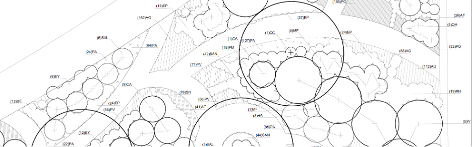

# Module 2b: Pollinator Garden Technical Plan and Plant Schedule

## Assignment Statement

{#fig-example_journal_entry fig-alt="A black and white landscape planting plan construction document showing overlapping circles and hatched areas representing trees, shrubs, and mass plantings. The plan is heavily annotated with leader lines pointing to alphanumeric codes that indicate plant quantities and species abbreviations." fig-align="center" width=100%}

### Overview

#### Point Value
30 points

#### Submissions

Note: Due dates are documented within the [course schedule](02_schedule.qmd). 

- One PDF containing one page.

### Introduction
This assignment introduces you to the process, standards, and methods required to achieve a professional quality planting implementation document (i.e., "contract document," or CD). Referring to the Mixed Pollinator Plan concepts that you've prepared during Module 2a, you will use AutoCAD to prepare a technically proficient planting plan and planting schedule. As we mentioned in class, even during the technical part of the planting design and implementation process, you should still find opportunities to improve your Module 2a design and address our in-class desk critiques. 

Objectives for this module include clear technical communication, a robust plant schedule that meets professional standards, and the continued development of planting design ideas and palettes. During this module, we'll also briefly review standard tree and shrub planting details.

### Submission requirements

#### AutoCAD Drawing Requirements
A ¼" = 1’-0" scale mixed bed planting plan on an Arch D-size sheet, submitted to Canvas Assessment Dropbox. It should fit on one sheet, but you may include more than one sheet in a multi-page, single PDF if needed. Elements must include:

- 2D plant symbols native trees and shrubs, created as CAD "dynamic blocks" with attributes; smaller shrubs may be shown as massed symbols, with connector lines 
- 2D plant symbols for larger native herbaceous perennials spaced 24" o.c. or greater
- 2D plant symbols for any perennials used singly or in small clumps as accents
- massed, small to medium-sized "interplanted" (mixed) native perennials shown as hatches/patterns. We will discuss how this gets shown in detail for perennials spaced about 18" or less o.c.
- Plant schedule (see requirements below)
- Title block with your name, date, course #, etc. 
- North arrow and numerical/non-graphic scale near plan (not in title block)
- Legend

#### Plant Schedule Requirements
- Columns must be shown in the following order:  
    * Key (or Code)
    * Quantity
    * Scientific Name (in alphabetical order within each category by plant form)
    * Common Name
    * Size
    * Condition (that is, the condition of roots or root containment)
    * Remarks (or Comments)
- Sub-divide the Schedule into broad categories by plant form, as follows:
    * Trees
    * Shrubs
    * Herbaceous Perennials
    * Graminoids (also called Grasses & Grasslikes)
    * and possibly: Groundcovers, Bulbs, Vines, Ferns & Mosses
- For each plant form category on the Schedule, list plants in alphabetical order by scientific name column. Then the Common name column will be to the right.
- Be careful with the rules for how to name cultivars in both scientific and common name terms (see lecture).
- Be meticulous about spelling, titles and sub-titles, formatting, and overall clarity. For proper nomenclature style, see the introductory syllabus lecture. 
- The plant "Key" (or "Code") is a plant label that is usually an acronym of the combined first letters of the Genus and the Species, in upper case. For example, Acer rubrum would be given the code AR. If there's another plant with "AR," use the second letter of the species, thus: ARu. Alternatively, you may use the USDA PLANTS database approach, i.e., a 4- or 5-letter acronym, but it's lengthy, and their website doesn't include many cultivars.
- "Quantity" denotes the total number of plants of that specie/cultivar for that single size in the overall Mixed Bed. If you have the same plant in 2 different sizes, it will require 2 separate row listings.
- "Size" refers to the plant’s size as acquired from the nursery at the time of installation, using standard industry terminology. Thus, sometimes it's designated by height, sometimes by width. For herbaceous perennials, size is usually indicated by the pot size, though sometimes they come in trays or plugs. For deciduous trees over about 8-10' in height at the time of planting, show caliper size—it varies depending on plant form and the type of root container. For coniferous trees, size is denoted by height, not caliper. Note that for some plant forms, such as herbaceous perennials, the size of the pot is sufficient—no need to show a plant size, since it's the important rootstock. Herbaceous perennials are often planted dormant in the Fall planting season, with little above-ground growth.
- For each plant form category on the Schedule, list plants in alphabetical order by scientific name column. Then the Common name column will be to the right.
- Be careful with the rules for naming cultivars in both scientific and common names (see lecture).
- Be meticulous about spelling, titles and sub-titles, formatting, and clarity. For proper nomenclature style, see the introductory syllabus lecture. 
- The plant "Key" (or "Code") is a plant label that is usually an acronym of the combined first letters of the Genus and the Species, in upper case. For example, Acer rubrum would be given the code AR. If there's another plant with "AR," use the second letter of the species, thus: ARu. Alternatively, you may use the USDA PLANTS database approach, i.e., a 4- or 5-letter acronym, but it's lengthy, and their website doesn't include many cultivars.
- "Quantity" denotes the total number of plants of that species/cultivar for that single size in the overall Mixed Bed. If you have the same plant in 2 different sizes, it will require two separate row listings.
- "Size" refers to the plant’s size as acquired from the nursery at the time of installation, using standard industry terminology. Thus, sometimes it's designated by height, sometimes by width. For herbaceous perennials, size is usually indicated by the pot size, though sometimes they come in trays or plugs. For deciduous trees over about 8-10' in height at the time of planting, show caliper size—it varies depending on plant form and the type of root container. For coniferous trees, size is denoted by height, not caliper. Note that for some plant forms, such as herbaceous perennials, the size of the pot is sufficient—no need to show a plant size, since it's the rootstock that's important. In fact, herbaceous perennials are often planted dormant in the Fall planting season, with little above-ground growth.
- You may use short forms in the "Size" column. For example:
    * caliper: 2" cal.     
    * height: 6’-0" hgt.     
    * spread: 36" spr.   
- "Condition" typically refers to how the roots are grown and contained. Thus, caliper trees' conditions are usually "B&B" (ball & burlap), although smaller stock may be planted as pots or even Bare Root (BR). Most shrubs are given by the size of the pot (e.g., #10 pot); smaller herbaceous perennials and grasses tend to be shown as pots or trays (e.g., #SP4, which is a +/- 1-quart, or 4", pot). Smaller groundcovers, grasses, and perennials are often supplied as 4”-5” deep plugs in trays of 32, 40, 50, or more.
- Refer to industry standards or a reputable wholesale commercial nursery catalog as a guide. The definitive guide is the American Standard for Nursery Stock, ANSI Z60.1-2014, by [American Hort](https://tflohr.com/wp-content/uploads/2024/08/T_PM_Mod_2b_ANSI_Nursery_Standards_2014.pdf){target="_blank"}.  American Hort is a new organization that combines the previous American Nursery and Landscape Association and the Association of Horticultural Professionals in the U.S.
- "Remarks" (or "Comments") are special requirements for the quality or characteristics of plants from the nursery or otherwise specific/unique planting instructions. Thus, for example, if you'd like an important small tree to have several main branches, you might write "Select low-branched" or "Multi-stem." For important specimen plants, specify "Pre-selected in the nursery by Landscape Architect." In addition, on-center (O.C.) spacings for massed smaller shrubs and most perennials and groundcovers can be shown in this column. Long-winded Remarks are best placed in the Planting Notes accompanying planting plans and schedules (not part of this module).

### Evaluation Rubric
I provided detailed evaluation criteria in @tbl-mod2b_eval. 

| Description | Value |
|:-------------|:-----:|
| **Planting plan content**            |           |
| You have developed and refined your design since Module 2a to contract document quality; responsiveness to Module 2a critique | 5 points |
| All required design elements are present | 5 points |
| **Planting plant technical drawing** |           |
| Your technical communication is of high-quality; accurate, with legible symbols, textures, line weight and value contrast, labels, and leader/connector lines; cleanness and organization of plan keys, callouts, etc. | 5 points |
| Your technical drawing is complete, organized, and appealing, including technical title block, legend(s), north arrow, scale, name, date, course, labels, etc. | 5 points |
| **Plant schedule content**           |           |
| You chose appropriate, diverse, and a balance of species/cultivar selections, refined and fleshed out since Module 2a | 2.5 points |
| Your plant schedule is accurate, with the appropriate specifications for all columns; accurate nomenclature; appropriate application of ANSI American Standard for Nursery Stock | 2.5 points |
| **Plant schedule technical drawing** |           |
| The schedule exhibits completeness, organization, correctness, and legibility; appropriate labeling, sizing, and formatting | 5 points |

: Module 2b evaluation rubric. {#tbl-mod2b_eval}

## Lectures
[Lecture 02b-2: Planting Plans and Schedules](https://pennstateoffice365-my.sharepoint.com/:b:/g/personal/tlf159_psu_edu/IQDhpTJu-n9fQLL-N0AYolgtAXmXZNn2QdnPgFSTZZfqWVk?e=UtN1yb){target="_blank"}

[Lecture 02b-3: Cost Estimates](https://pennstateoffice365-my.sharepoint.com/:b:/g/personal/tlf159_psu_edu/IQAl9Kh7L2vkRLZwiDRx38vEATvLUyK_lRXlPx9h6gr0rsU?e=sEIHsR){target="_blank"}