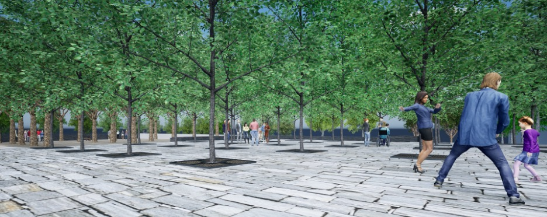

# Module 3: Technical Treed Plaza Plan and Details

## Assignment Statement
{#fig-example_journal_entry fig-alt="3D architectural rendering of an urban plaza paved with light gray stone. A formal grid of trees with square metal grates creates a dense, shaded canopy overhead. Several people are enjoying the public space, including a family playing in the right foreground and other small groups walking and gathering in the background." fig-align="center" width=100%}

### Overview

#### Point Value
60 points

#### Submissions
Note: Due dates are documented within the [course schedule](02_schedule.qmd). 

- One PDF containing one page.

### Introduction
This module presents another essential type of landscape installation: the urban treed plaza in a hardscape context. Trees in the city (or on a large, crowded campus) provide a myriad of services. Appropriately designed, they ameliorate microclimate, providing essential shade and evapotranspirative cooling during hotter weather. They slow stormwater runoff, enhance infiltration, filter polluted air, fix carbon, and exude fresh oxygen. They help calm traffic and, in sufficient mass, can soften the din of the city. Trees animate the urban environment by providing shelter and food for birds, pollinators, and other creatures. They flower, fruit, and mark the seasons’ passing in locales where live greenery is often in short supply. Native trees, in particular, can harbor pollinator larvae. And, of course, urban trees define and create volumetric space—so crucial to creating convivial and memorable urban places. 

One of this module's key challenges is promoting tree longevity and health while still accommodating the complex physical and social dynamics of the urban environment. Urban tree longevity is closely tied to the volume of high-quality soil, free exchange of gases available to roots, and adequate (but not excessive) water. As we'll see, non-permeable paving and compressive forces can result in soil compaction and lack of aeration, which can frustrate these objectives, as can poorly chosen and arranged tree species.

Thus, this module emphasizes the interplay between tree selection, plaza layout, plaza surfacing material, and below-ground root zone arboriculture and technology. There will be a brief sketch concept exercise followed by an intensive period of exploring and developing the technical aspects of a proposed 'urban' treed plaza for the Millennium Science Complex. [Please re-read the Goals, Objectives, and Program statement provided earlier in the semester, including the vision that sees this treed plaza serving students, university employees, and visitors.]

### Submission requirements
We will begin with a sketch concept exercise and then proceed to technical design and development for much of the module. Careful selection and orchestration of shade trees, associated amenities (e.g., seating, café tables, lighting), and plaza surfacing are essential to planting projects like this one. To coordinate the exacting dimensions of below-grade technology (plastic soil cells) with various on- or above-grade elements, you must also research, choose, and delineate the modules of the root zone technology during this phase. Thus, you will see that conceptual and technical design are closely interwoven – it's folly to design this kind of landscape without knowing which technology you'll be using and its dimensional controls.

#### General Design and Technical Parameters
- You must design the tree-planting strategy, plaza surfacing, and landscape amenities for the tree plaza in accordance with the criteria outlined in this statement. The plaza must demonstrate **one of the two plastic root zone technologies we'll explore – **plastic modular soil cells and modular paving above**. 
- Layout the plaza hardscape and tree **bosque** in careful coordination with below-ground root zone technology, taking into consideration the paving technology (see next bullet). There are several common tree layout patterns, most borrowed from a long history of orchard design: square, offset, triangular, quincunx/diamond, etc. 
- The plaza will demonstrate tree planting in ‘hard’, but porous modular paving and associated modular soil cells below; this surface should logically be located nearest the ADA-accessible route between site arrival areas and building entries. 
- The bosque canopy should be continuous over the plaza terraces. 
- **Research and select appropriate urban tree selections**. The plaza must be populated with a **native cultivar** (e.g., improved to tolerate urban conditions or a **non-native tree specie/cultivar**. Coordinate your tree selection with your intentions for spatial volume and below-grade root zone space. 
- Tree forms shall be those medium-sized trees that:
    * Provide a consistent leafy "ceiling" (underside of canopy) of 7’-12' in height within a few years;
    * Have a medium to light branching and leaf density that creates a dappled shade of 50-70% after about eight years of post-installation growth;
    * Provide a pleasing repetition of reasonably sized tree trunks. 
- Inappropriate tree forms include:
    * Trees that are too small make people feel constrained. Chosen tree species must have a minimum 6’-6" clearance to the first branch, as measured from pavement level, to allow safe pedestrian passage near the trunk. Thus, small trees such as Serviceberry or Crabapple are unsuitable in this context.
    * Trees that are too large. Treed plazas rely on repetition – particularly of trunks – to create the "bosque" effect and define multiple sub-spaces. Since our plazas are relatively small, avoid trees with large spreading canopies that must be spaced at 22' or more on center (O.C.), or those with overly large trunks. Examples include the species of the Plane tree and the Red oak.
    * Trees with inappropriate canopy shapes and densities. Avoid tight "lollipop canopies" that don't mesh well (e.g., some Little-leaf linden cultivars). Also, avoid pyramidal or columnar trees that allow large gaps to the sky above.
- The entire terraced plaza area must be fully ADA accessible. Anticipate pedestrians needing to access the main MSC entryways and maintain clear access along the sidewalk, flanking the building sides of the plaza levels. Locate tree trunks and other impediments according to balancing ease of movement and the need to define bosque interior sub-spaces.
- The sizing and location of the plaza's surface elements—tree trunk, planting pit hole, and paving—will be strongly influenced by the below-grade technology, particularly the modular soil cells with fixed dimensions (like interlocking Legos). 
- In your drawings, represent trees about eight years after planting, when their canopies are becoming well-meshed with adjacent canopies. By then, trunk diameter will be somewhere between 6" and 12" DBH (diameter breast height), depending on the species/cultivar selected.
- Openings in the modular pavement must anticipate trunk growth but should be small enough to allow pedestrian movement near tree trunks. Strike a balance. The paver retention collar will define such openings (see below).
- **Trees may not be planted in above-ground planters or large beds**. Remember, the point here is to integrate shade trees seamlessly into the urban plaza's paved surface.
- All trees should be planted at 3" to 4" caliper. This strikes a balance between vandal resistance and economy. 
- Show accurate tree layout dimensions across the entire plaza. Be sure to tie the dimension to the existing built form. Choosing a well-chosen point of beginning (POB) is good practice as you start dimensioning the plaza layout.
- Show what's on and above the plaza surface: trees, tree holes, paving, seating, and optional lighting and tables. We will focus on dimensioning the tree layout, so no dimensioning is required on other objects on the layout plan (though details require further dimensioning).
- Label and layout the paving materials on the plaza. Only dry-laid, permeable modular or cut-stone pavers are permitted. Do not use cast-in-place concrete or asphalt paving.
- Delineate the below-ground perimeter extents of the root zone area (modular plastic cells) with distinctive dashed lines. There is no need to show dimensions to this specific perimeter. The entire below-grade extent of the plazas should include the required root zone technologies. Show the dashed lines in your Legend as well.
- Ensure the paving pattern/module repetition anticipates and aligns with tree pit openings and paver retention collars. Avoid awkward on-site paver cutting.

#### Root Zone Technologies
**Modular plastic soil cells** (select one of the two shown below)
**Deep Root's Silva Cell 2** or **Citygreen's StrataVault** are currently the most widely used systems. These rigid, plastic (and expensive!) structures support permeable paving above while allowing friable, high-quality topsoil and airflow in the voids beneath the cell's top deck.

#### Paver Retention Collars at Tree Pit Openings
Special attention must be paid to securing the paving around the tree hole when using modular paving. The plastic soil cells may have ready-made solutions (e.g., retaining root deflectors). You could devise a two-piece collar fabricated from commercial-grade ¼" thick hot-dipped galvanized steel or powder-coated plate steel for both technologies. Alternatively, you could choose between a cast-in-place concrete collar or a pre-cast concrete collar, which comes in two pieces that clip together. 

#### Summary of Required Physical Elements
- A carefully chosen tree specie/cultivar
- Permeable modular pavers or cut stone pavers 
- Plastic modular soil cells
- Custom-designed paver-retention collars around the base of the trunks are to be used in conjunction with modular soil cells associated with the hard-surfaced plaza
- Provide seating (off-the-shelf or your own custom design)
- Café-style tables are optional
- LED lighting is optional; off-the-shelf is recommended
- Label items where appropriate

#### AutoCAD Drawing Requirements
Neatly compose all elements onto two or three 24" x 36" sheets and submit them as PDFs to the Canvas Assessment Dropbox. All components are to be drawn in AutoCAD. Required components include:

- **A Root Zone Plan** at 1" =10’-0" scale. With paving "peeled back," show a simple, plan-view line drawing layout of:
    * Modular soil cells, with a dashed line showing paver retention collars
    * Simple, non-illustrative tree symbols, including trunk cross-hairs
    * Key dimensions and simple outline delineations of tree collars, etc.
    * Other amenities need not be shown in this simplified plan view. It's essential to understand and graphically communicate the relationship of modular cells to openings/tree trunks/rootballs.
- **Treed Plaza Plan**. Prepare a 1" =10’-0" plan based on your initial sketch concept. As always, we expect you to improve as you transition from conceptual to technical and detailed. Show all above-surface features and tree layout dimensioning. Show dashed lines for the extent of the soil cells below grade. The plaza must demonstrate: 
    * The plaza level uses modular soil cells with structural paver-retention collars (no surface tree grates, but below-paver grates are permissible).
- **Technical Details**. Three (3) technical details, with associated notes, are required:
    * **Tree Planting in Modular Soil Cells** – with Paver Retention Collar: ½" =1’-0" scale cross-section showing the full tree installed in your chosen modular soil cells. A paver retention collar (steel or concrete) must be attached to the top/inner edge of the soil cell, forming the perimeter of the planting hole, and stabilizing the pavers located away from the hole. Include associated technical and planting notes. 
    * **Tree Planting in Modular Soil Cells** – Plan View Blow-up: ½" =1’-0" or 1" -1-0" scale plan view blow-up showing both the modular paving context and a "peel-away" showing the modular soil cell below (that is, paving peeled back). See note in #1 for paver retention collar stipulation.
    * **Tree Planting in Modular Soil Cells** – Paver Retention Collar Blow-up: A 3:1 or 2" =1’-0" scale cross-section blow-up detail of the paver retention collar and related tree opening and adjacent paving. See note in #1 for collar stipulation.
- **General requirements for details**:
    * Using accurate dimensioning, show the adjacent above- and below-ground elements, including tree (canopy, trunk, rootball, and immediate above- and below-ground contexts), planting pit hole, surrounding paving, planting soil, rootball anchoring, subsoil, and associated sub-base materials, and any necessary geotextile/filter fabric. Note: Conventional aeration/irrigation/drainage pipe systems shouldn't be necessary with our two rootzone technologies.
    * Paving must be modular and either manufactured or cut stone for the' hard' plaza. It must be dry-laid onto a granular setting bed (that is, not on a concrete slab). It must be permeable, with 3/8" – 1/2" gaps between pavers to accommodate water percolation and gaseous exchange below and above grade.
    * Add notes about how the actual tree gets planted above and below grade. Select notes from a standard soft-landscape tree-planting detail can be translated into these specialized hardscape details. 
    * All trees should have a rootball anchoring system. Refer to Duckbill's Earth Anchor, GreenBlue Urban's ArborGuy Anchor Plate, or Drive-in Anchor, or similar. Conventional above-grade tree stakes are not appropriate for this plaza context.
    * Using the ANSI Z60 standards, rootball dimensions for 3" - 4" caliper trees will be 36" - 42" in diameter and 24" - 26" in height. 
    * For the ‘hard’ plaza, show mulch around the base of the trunk: wood chips? river stones? other? Mulch should be visually appealing, easy on the tree, and porous to allow water and air to pass through easily. Mulch isn’t needed for the ‘soft’ plaza because the aggregate surfacing performs mulch duties.
    * Include titles, scales, neatly arranged labels and leader lines, technical notes, and proper dimensioning style.
- **Ideal and Actual Soil Volumes**. One of this module's big 'take homes' is to ensure that urban trees have plenty of fertile, friable, well-aerated soil throughout the below-grade root zone gallery. Thus, we want you to show both ideal and actually achieved soil volumes available to trees on each of your two plaza levels.
    * **Ideal** soil volumes Per Tree on Each Terrace. Select one of the following methods:
        + Lindsey and Bassuk (1992) (see lecture) call for two cu. ft. of soil for every one sq. ft. of canopy area (plan view) of the tree at about 80% mature size (10-15 years after installation). Determine the canopy's square footage using π r2, where π (Pi) = 3.14.
        + Greenblue Urban's Soil Volume Guide. If your exact tree isn't given, select a similar tree to determine the ideal soil volume.
    * **Actual** Soil Volumes Per Tree on Each Terrace
        + **Method**:  Calculate the overall soil volume of the root zone gallery (LxWxH) for each terrace, then subtract the volume of inert gravel or plastic (see bullets below), then divide that actual soil volume by the number of trees associated with that gallery = actual soil volume/tree.
        + **Assumptions**: For modular soil cells, assume 90% of the volume is soil—the remaining 10% is plastic. Include rootballs as “soil,” as well as the narrow outside bands of backfill soil beyond the actual plastic cells.
    * Show both Ideal and Actual calculations on a table on your sheet. Include calculations.
- **Tree Planting Schedule**. Include a complete Tree Planting Schedule similar in format to the one you prepared for Module 1 (but only with trees this time). It will be a short list.

### Evaluation Rubric
I provided detailed evaluation criteria in @tbl-mod3_eval. 

| Description | Value |
|:-------------|:-----:|
| **Plaza Plan: Content**|                  |
| Concept promotes convivial, comfortable, and technically proficient outdoor treed plaza. | 7.5 points |
| Appropriate tree selections, sizing, and positioning; accurate and appropriate dimensioning; adherence to all criteria cited above | 7.5 points |
| **Plaza Plan: Communication** |          |
| Overall clarity and precision of technical plan drawing (e.g., line hierarchy, patterns, and symbols) | 5 points |
| Completeness and clarity of tree schedule | 5 points |
| Effective construction sheet composition | 5 points |
| **Details: Content** |                   |
| Ingenuity, feasibility, technical proficiency, and completeness of tree details that promote tree health and stability | 7.5 points |
| Adherence to all criteria cited above | 7.5 points |
| **Details: Communication** |                   |
| Overall clarity and precision of technical details (e.g., line hierarchy, patterns, symbols, textures, colors, dimensioning)| 5 points |
| Scale, title, etc. | 5 points |
| **Soil Volume Calculations** |        |
| Completeness and accuracy | 2.5 points |
| Calculations shown        | 2.5 points |

: Module 3 evaluation rubric. {#tbl-mod3_eval}

### References
Lindsey, P., & Bassuk, N. (1992). Redesigning the urban forest from the ground below: A new approach to specifying adequate soil volumes for street trees. Arboricultural Journal, 16(1), 25–39. [https://doi.org/10.1080/03071375.1992.9746896](https://doi.org/10.1080/03071375.1992.9746896){target="_blank"}

## Lectures
[Lecture 03-01: Trees in an Urban Landscape I](https://pennstateoffice365-my.sharepoint.com/:b:/g/personal/tlf159_psu_edu/IQCh3Xrwyah0SZLzJlzJNL-tASU6pUyRZ-kKPlU3fGdEJr4?e=qTRjGn){target="_blank"}

[Lecture 03-02: Trees in an Urban Landscape II](https://pennstateoffice365-my.sharepoint.com/:b:/g/personal/tlf159_psu_edu/IQDW_Q-xElUzTbnJinA13g3CAddvqejj7jdoIsv7OmjgrEk?e=hVsjgc){target="_blank"}

[Lecture 03-03: ACAD Dimensioning Plans Overview](https://pennstateoffice365-my.sharepoint.com/:b:/g/personal/tlf159_psu_edu/IQAJp-igtaI6SImL65GX9WzTAdoaToTtvBOP6xjvfN3TCo0?e=2NJOtx){target="_blank"}

[Lecture 03-04: ACAD Tree Details Overview](https://pennstateoffice365-my.sharepoint.com/:b:/g/personal/tlf159_psu_edu/IQACUW0GJBkcTZn5OCStVno_AeRQSiBpKcUnu65dcet2UpY?e=bY0Aaw){target="_blank"}

[Lecture 03-05: Soil Volume Calculations](https://pennstateoffice365-my.sharepoint.com/:b:/g/personal/tlf159_psu_edu/IQCZHFXz8a0fRYxqtdWlodFwAWAeul__rMjrh5PCk7318xc?e=l4I6nM){target="_blank"}