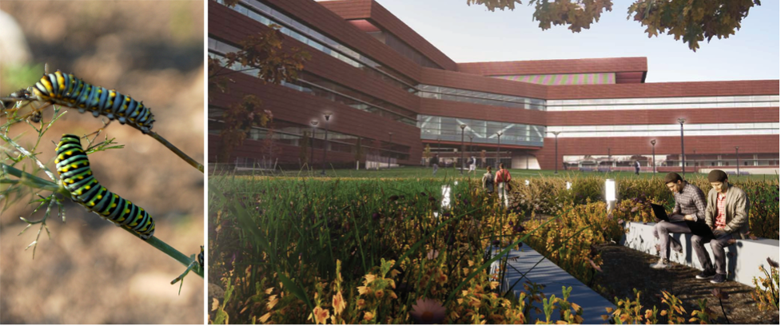

# Module 4a: Meadow Palette and Concept 

## Assignment Statement
{#fig-example_journal_entry fig-alt="A side-by-side image contrasting nature and architecture. On the left, a macro photo of two Black Swallowtail caterpillars on green stems. On the right, an architectural rendering of a large, modern reddish-brown building with horizontal windows (MSC building at Penn State University Park). In the foreground courtyard, tall grasses and wildflowers grow near a concrete bench where two young men are sitting, one working on a laptop, while other people walk toward the building in the background." fig-align="center" width=100%}

### Overview

#### Point Value
30 points

#### Submissions
Note: Due dates are documented within the [course schedule](02_schedule.qmd). 

- One PDF containing two pages.

### Introduction
Module 4 focuses on the Planted Pollinator Meadow component of the Millennium Science Complex initiative, keeping the site’s overall goals and program in mind (please revisit the [Planting Objectives, Program, and Guidelines](@sec-program). Module 4 comprises two sub-modules: 

- Module 4a Meadow Palette and Concept, and 
- Module 4b Technical Meadow Plan, Schedules, and Establishment Notes.

Recall that the Planted Pollinator Meadow was introduced in the [Planting Goal, Objectives, and Program](@sec-program). In particular:

> The Planted Pollinator Meadow is a planted herbaceous community that replaces the Millennium Science Complex's vast, underutilized, and unsustainable turfed plateau. It demonstrates graminoids (mostly grasses, but also some sedges and rushes) and perennial wildflowers (‘forbs’) and their accompanying ecologies. The new, mostly self-sustaining—but still managed—plant community will serve as a learning environment for students, faculty, and visitors exploring meadow ecology, the essential roles of diverse pollinators, and establishment techniques. It should also be a pleasant and inspiring place to experience a richly textured, colorful, and animated setting nearby. 
>
> Grasses will form the ‘backbone’ of the meadow complex since wildflower-only plantings tend to get spindly and turn weedy quickly. Two primary categories of grasses tend to dominate natural grasslands: **warm-season grasses** (primarily found in the Midwest and southern U.S.) and **cool-season grasses** (mostly found in the northeast and northwest U.S.).  We will not intermix warm- and cool-season grass meadows because they require differing establishment approaches, even though they often coexist in natural settings.
>
> What begins as a plant assemblage will evolve into a largely self-sufficient habitat that requires only periodic management, informed by regular monitoring.

Therefore, the **planted pollinator meadow ecosystem** envisioned for much of the currently turfed area of Millennium Science Complex will be an herbaceous complex demonstrating mixed graminoid and forb communities. Once well established in 3-4 years, this mostly self-sustaining installation will serve as a learning environment for students, faculty, staff, and visitors exploring ecology, pollinator habitats, and associated techniques. As importantly, it should also be a pleasant – even **recuperative and inspiring** – place to experience a vibrant and richly textured setting close at hand. 

While some of the meadow's experience will be from along the existing perimeter sidewalks and even visually from surrounding buildings, the primary means of experiencing it will be through both the existing cross-meadow walkways and a new, more informal unpaved path system that allows pedestrians to immerse themselves in the meadow. Recalling our Module 1a analysis, your solutions should consider soil, microclimatic, landform, spatial, ecological, social, and functional conditions in and around the site.

### Design Requirements {#sec-mod_4a_design_criteria}
**Penn State is interested in a meadow complex comprising *three* distinct native plant communities, along with a small installation of sustainable turf**. I outline the details in the following sub-sections. 

#### Overall Meadow Complex Design Criteria

- Ensure that users can access the meadow’s interior! Remember, the cross-meadow concrete paths will remain (you can remove one, if you wish), while the other ‘immersive’ side paths should use unpaved, permeable surfacing (e.g., mown Eco-grass, wood chips, pea gravel, etc.). We encourage you to investigate pathway options on your own.
- Provide several 2-3 small seating nodes in strategic, comfortable locations.
- Ensure that pedestrians feel safe and secure. Vegetation over 3’ in height should not crowd the primary pathway. Your design should avoid potential areas of pedestrian entrapment and concealment. Everyone should feel safe in your meadow complex! This requires the strategic placement of your taller plants.
- You must design a resilient meadow. To do so, a new best practice is to ensure you have at least five families of plants represented in each of your meadow types.
- Each meadow’s bloom period should be as long and continuous as possible. The required phenology chart will help you visualize the sequences. Remember at least 5+ blooming species per season.
- The phenology chart is more than a bloom chart. It should chart both blooming (targeting pollinator needs) AND seed-head development and persistence through the fall and even into winter (targeting insect and small-mammal habitat and resident seed-eating birds).
- You must create a habitat for meadow-dwelling fauna, particularly pollinators. Consider pollinators’ life cycles (e.g., butterflies, moths, native bees and flies, wasps, beetles, hummingbirds, bats, etc.). Optionally, you may use a small number of woody plants to better achieve this ecological objective. In this case, you must indicate these plants on the plan and provide an additional planting schedule. 
- Reminder: when creating habitat for a particular species or guild of species, research their foraging, nesting, reproductive, and water needs throughout their life cycle and seasonal cycles to ensure they are met within your design or are interconnected with nearby areas. 
- You must design your own custom species choices. Do not use commercial ‘off-the-shelf’ seed mixes – except Eco-Grass or similar for the active-use lawn space noted above.
- Controlled burning can be an effective weed-control tactic for upland warm-season grasses (the primary plants of the Tall-grass prairie biome). If you choose this approach, allow a minimum 10’ firebreak between meadows and buildings, plazas, a Mod. 1 pollinator garden, woody species, and any flammable amenities. 
- An alternative to controlled burning of the warm-season grass meadow is a special mowing regime sometimes called “Spring scalp mowing”. This emulates fire ecology (to be discussed in an upcoming lecture).
- Emphasize ecosystem functions but also strive for beauty. Design with colors, textures, odors, sounds, patterns, and serendipity through time (days, nights, seasons). “Messy ecosystems and orderly frames” (per Joan Nassauer) apply to this situation.
- Be sure all plants in your palette will thrive in Plant Hardiness Zone 6b/7a.
- Note that the Army Corps’s (United States Army Corps, 2023) list of wetland plants sometimes shows NI: “Not Indicated.” If you choose a plant with this status, find another reference to help you place it based on the soil moisture it prefers.

#### Prairie Meadow
The prairie meadow comprises a mix of **native upland warm-season (C4) grasses and associated forbs**. I provided additional requirements below.

- Select at least five grass species and 10–15 forb species.
- Taller warm-season grasses (3’–7’ height) must include Big bluestem and Indian grass (flagship Tall-grass prairie plants). Other tall grass species could include Eastern gamagrass, Purpletop, and perhaps one or two others. 
- Shorter warm-season grasses (1’–3’ height) may include Side-oats grama, Little bluestem, Prairie dropseed, Blue grama, Purple love grass, Hairy grama, Indian wood oats, and a few others. 
- You may intermix taller and shorter grasses or create a mosaic of taller and shorter sub-meadows (if so, list them separately).
- All plant selections should be listed as Facultative Upland (FACU), Upland (UPL), and FAC (Facultative) in the U.S. Army Corps of Engineers. 2023. 2022 National Wetland Plant List – Eastern Mountains and Piedmont Region, or Northcentral and Northeast Region - Show each plant’s “wetland designation” on your plant lists.  The files are located here: 
    * [Eastern Mountains and Piedmont Region](https://pennstateoffice365-my.sharepoint.com/:b:/g/personal/tlf159_psu_edu/IQDBzu2n5JzKQrlMYI2iUWOgARHj0r6OVHA8O0BuDFaT6fU?e=qSjdG6){target="_blank"}
    * [Northcentral and Northeast Region](https://pennstateoffice365-my.sharepoint.com/:b:/g/personal/tlf159_psu_edu/IQCqPR4bdKdtT7zYI7DLzKoWAYGmfzFj3OpO1zIoR35eFA0?e=8XYnWA){target="_blank"}
- Note:  Switchgrass is a common tall-grass prairie specie, but it aggressively self-seeds during the meadow establishment phase, so it should be avoided for the first 3-4 years as the other grasses become established

#### Mesic Meadow
The mesic meadow comprises a mix of **native cool-season (C3) grasses and associated forbs**, all of which are adapted to mesic soils. Stipulations include:

- All selections should be listed as Facultative Upland (FACU) or Upland (UPL) in the National List of Wetland Plant Classes, using the previously listed U.S. Army Corps of Engineers. 2023. 2022 National Wetland Plant Lists.
- Select 3–5 grass species and 6–10 forb species. To give you a head start, cool-season grass species could include Canada wild rye, Virginia wild rye, Bottlebrush grass, Prairie Junegrass, Tufted hair grass, Cluster fescue, Creeping red fescue, Poverty grass, and Upland bentgrass. Research each of these to inform your selections.
- Because cool-season grasses can invade the slower-to-establish warm-season grasses during the initial phase (3-4 years), mesic and warm-season meadows should be separated by a path, soil edging, or a change in elevation.

#### Rain Meadow
The rain meadow is for stormwater management and infiltration. You will create a designed wetland habitat in the closed depression designated on the base plan. This meadow must have a unique seed mix of **graminoids and forbs suited to periodically saturated soil conditions**. You should take a basic 2-zone approach:

- **Lower Zone**: includes the flat basin bottom and lower side-slopes; hydric-mesic soils;  be sure to vegetate this area with hydrophytes classed as Facultative Wetland (FACW) species (see Army Corps reference above). Do not use Wetland Obligate (OBL) species because you can’t guarantee that hydric soils will consistently form on the bottom flats. 
- **Upper Zone**: includes the basin’s upper side-slopes and high/upland perimeter; mesic soil; vegetate with a mix of Facultative Wetland (FACW) and Facultative (FAC), and perhaps a few Facultative Upland (FACU) species on the outer/higher fringes. Please note that there is a mound in the center of the depression, and this area should also be considered an upper zone.
- **Other Rain Meadow stipulations** are as follows:
    * The closed depression is shown on the CAD base plan. This is where the rain meadow must occur.
    * The basin is about 18”–24” deep to accommodate a maximum standing water depth of about 12”. The bottom is relatively flat to accommodate slow infiltration, and the side slopes are no steeper than 4:1. 
    * Assume that soil in the Lower Zone can infiltrate standing water at a rate of about 6” per 24 hours. Include an overflow standpipe for heavy rain periods; overflow will be directed to the sub-surface stormwater retention facility currently on site.
    * For the bottom (wettest) zone, your native graminoid species mix must have at least two representatives each of FACW cool-season grasses, sedges (Carex, Scirpus), and rushes (Juncus), plus 5–8 native FACW forb species. Regional phenotypes/ecotypes are strongly encouraged (these are identified in Ernst Seed species descriptions, or available as plugs from several nurseries listed in the references section below. Again, show the Wetland Plant class for all plant selections.
    * Grasses suitable for the Lower and Upper Zones could include blue joint grass, Riverbank wild rye, Rattlesnake manna grass, Fowl bluegrass, and river oats. 
    * You must include an erosion-control blanket (“ECB” +  staples) for the Rain Meadow side slopes, basin bottom, and lead-in swale as part of your seeding application to hold the seed in place during larger rainstorms. The selected ECB must be bio- or photo-degradable within 12 months after installation. We suggest single-net excelsior or chopped straw with biodegradable netting, held in place with biodegradable pegs, pins, or “eco-stakes.” You will need to research; see the suggested sources in the references section below.

#### Eco-lawn
The purpose of the eco-lawn is to provide space for lawn-based activities, such as running, frolicking, and lawn games, while being more sustainable than traditional turfgrass. Eco-lawns/Eco-turf/Low-mow/No-mow use a mix of cool-season non-native grass cultivars (mostly fescues) that grow to about 6” – 8” in height and can be mown as infrequently as once or twice per growing season. Low-growing nitrogen-fixing legumes (e.g., clovers, Bird’s foot trefoil, or a smaller cultivar called “micro-clover”) may be included. Eco-lawns are more sustainable than conventional bluegrass/fescue turfgrass blends.

A commercial “Eco-grass” seed mix is available from Prairie Moon Nurseries. A “Low-mow” mix is available at Prairie Nursery [https://www.prairienursery.com/resources-guides/no-mow-resources/](https://www.prairienursery.com/resources-guides/no-mow-resources/){target="_blank"}; and an “Eco-Turf Mix with Micro-clover” can be found at PT Lawn Seed [https://ptlawnseed.com/products/pt-769-r-r-eco-turf-mix](https://ptlawnseed.com/products/pt-769-r-r-eco-turf-mix){target="_blank"}. You may find other variations on the market. Additional eco-lawn criteria include: 

- This lawn should be adjacent to a paved sidewalk and well-demarcated from meadows using steel edging so that the lawn grasses are less likely to invade the meadows. 
- The lawn area should be about 3,000 – 5,000 sq. ft.

#### Wetland Plant Indicator Descriptions
You must reference each plant’s wetland indicator status to determine which meadow type your plant belongs to. Details are provided in @tbl_wis. 

| Indicator Status | Designation | Qualitative Description (Lichavar et al., 2016) |
|:-----------------|:------------|:------------------------------------------------|
| Obligate (OBL)   | Hydrophyte  | Almost always occurs in a wetland               |
| Facultative wetland (FACW) | Hydrophyte | Usually occur in a wetland, but may occur in a non-wetland |
| Facultative (FAC) | Hydrophyte | Occur in a wetland and non-=wetland |
| Facultative upland (FACU) | Nonhydrophyte | Usually occur in non-wetland, but may occur in a wetland |
| Upland (UPL) | Nonhydrophyte | Almost never occur in a wetland |
| NI | - | Not indicated |

: Wetland plant indicator status (Lichavar et al., 2016). {#tbl-wis}

### Submission Requirements
Neatly compose all required elements into two or three visually appealing 2’x3’ sheets, with a graphic title and sub-titles, name, course/course #, dept., scales as appropriate, north arrow, date, etc. Submit to Canvas by the deadline as a multi-page, single, compressed PDF. Required elements include: 

1.	**Design Narrative**.  One or two convincing and articulate short paragraphs describing your meadow and design intent.
2.	**Rendered Plan**. This is a full-color graphic plan rendering at 1”=30’ scale. SketchUp or Rhino, along with Twinmotion or Lumion, are encouraged, but we are also open to using Photoshop or Rhino. Show the three meadow types and the Eco-turf called for above. Show both existing and new/proposed path(s) through the meadow and at least one seating node. Show pathway lighting. Label properly and include a legend and a north arrow.
3.	**Plant Palette**.  Include plant names (Scientific and Common), color thumbnail photographs of all plants, and brief bullet descriptions, including any notable ecological roles. Organize by the four cover types (three meadows, one sustainable lawn), with sub-categories organized by plant form (grass, grass-like, forb). Optional woody plants should be shown separately. List plants in alphabetical order by Scientific name. We encourage you to integrate the palette with the Phenology Chart below. **Be sure to specify the types of pollinators that are attracted to your selected plants**. 
4.	**Bloom and Seedhead Phenology Chart**.  A graphic chart showing week-by-week bloom times of all meadow forbs through the growing season, plus development and persistence of grass and forb seedheads extending into the fall and, in some cases, the winter. The chart may be integrated with Plant Palette or separately. A general best practice for accommodating pollinators is to have at least 5 blooming species for each forager throughout the growing season, with particular attention to ensuring sufficient early- to mid-spring and mid- to late-fall blooming species.
5.	**Rendered Perspectives**.  Prepare two fully rendered and colored perspectives: i) bird’s-eye, at about 30-50 feet above grade, and ii) human standing height at about 6 feet above grade. Together, these will provide a visual sense of both spatial overview and experiential immersion. Provide explanatory captions.
6.	**Rendered Section-Elevation**.  One ¼”=1’-0” scale section-elevation illustrating an important seating node area and nearby meadow(s). Show a realistic fore, middle, and background. Label/annotate key elements and plant communities. Include a diverse range of humans enjoying and studying your wonderful meadows.

### Evaluation Rubric
I provided detailed evaluation criteria in @tbl-mod4a_eval. 

| Description | Value |
|:-------------|:-----:|
| **Spatial/Physical Design**|                  |
| Creativity, harmony, and functionality expressed in the planting design | 6 points |
| Responsiveness to the problem statement requirements                    | 6 points |
| **Plant Palette and Phenology**|                  |
| Balanced promotion of both ecological and aesthetic objectives | 3 points |
| Adherence to other detailed criteria stated above | 3 points |
| Thorough and accurate phenology (bloom times, other pollinator accommodation characteristics, and aesthetic features by seasonality) | 3 points |
| Accuracy of nomenclature (use resources provided earlier in the semester to ensure accuracy) | 3 points |
| **Visualization/Communication**|                  |
| Clear, complete, and appealing graphics with appropriate captions and labeling | 2 points |
| Thoughtful and articulate writing | 2 points |
| Orderly and appealing sheet composition | 2 points |

: Module 4a evaluation rubric. {#tbl-mod4a_eval}

### Recommended Design Process
I suggest the following approach to completing Module 4a. 

1.	Revisit the Millennium Science Complex analyses.  We suggest that you draw a quick working section (1/8” scale) of the site to get a renewed feel for the site regarding landform and spatial volume.
2.	Research and develop the draft plant palette. At the same time, prepare a working phenology chart to help you understand the timing of forb blooms and seedheads. (Again, meadow flowering should be as long and continuous as possible to support pollinators.) Collect plant information and images as you go (keep a list of URLs for your References).
3.	Design the meadow spatially, and write a draft design narrative. Let design, ideation, and writing inform each other. Develop renderings first to inform concept development and, as you shift to Step 4, to communicate with others.
4.	Refine all required Module 4a elements.
5.	Compile elements into a well-choreographed whole and submit the project to Canvas by the deadline.
6. Continually revisit the assignment statement to ensure you are completing all the required elements of the submission.

### References
[Add references from my website]{.highlight color="yellow"}.

Crain, R. 2017. The Power of the Palette: A Tool to Guide Planting Decisions. http://content.yardmap.org/learn/planting-palettes/

Dept. of Entomology 2016. Bees, Bugs & Blooms – A pollinator trial. Penn State, https://ento.psu.edu/news/bees-bugs-blooms-2013-a-pollinator-trial

Dept. of Entomology, Step 3: Provide Shelter (pollinator habitat). Penn State University, https://ento.psu.edu/research/centers/pollinators/public-outreach/cert/cert-steps-step3

Ernst Seed catalog, 2022-2023. http://www.ernstseed.com/contact-us/catalog

Ernst Seed’s “Seed Finder Tool” https://www.ernstseed.com/seed-finder-tool/

Garneau, T. et al., Conserving Wild Bees in Pennsylvania. https://extension.psu.edu/conserving-wild-bees-in-pennsylvania 

Mid-Atlantic Native Plant Farm, Inc.  (online nursery catalogue; good for plug trays and bare-root perennial stock)  https://midatlanticnatives.com/

Heller, S. et al., 2019. Diversified Floral Resource Plantings Support Bee Communities after Apple Bloom in Commercial Orchards, Scientific reports, 9: 17232, https://www.nature.com/articles/s41598-019-52601-y

Laughlin, D. and C. Uhl. 2003. The Xeric limestone prairies of Pennsylvania. (on Canvas)

Minnesota Stormwater Manual: Erosion prevention practices / erosion control blankets and anchoring devices https://stormwater.pca.state.mn.us/index.php/Erosion_prevention_practices_-_erosion_control_blankets_and_anchoring_devices

New Moon Nursery:

Native Perennials.  http://www.newmoonnursery.com/Perennials

Grasses.  http://www.newmoonnursery.com/index.cfm

Stormwater Management, Rain Gardens http://www.newmoonnursery.com/index.cfm/fuseaction/plants.main/alphaKey/J-L/typeID/8/index.htm  and  http://www.newmoonnursery.com/index.cfm

North Creek Nursery (good for plugs):  https://www.northcreeknurseries.com/

Pollinator Partnership and NAPPC. Selecting Plants for Pollinators: Central Appalachian Broadleaf Forest. www.pollinator.org/PDFs/Guides/CentralAppalachianrx7FINAL.pdf

Prairie Nursery Native Plants and Seeds–

Native Wildflowers. https://www.prairienursery.com/store/native-wildflowers

Native Grasses. https://www.prairienursery.com/store/native-grasses

Prairie Moon Nursery: https://www.prairiemoon.com/

Surcică, A. et al., Pollinator Food., Dept. of Entomology, Penn State, https://ento.psu.edu/files/pollinatorfood/view

Sylva Native Plant Nursery / Wet Meadow species (good for plugs):  http://www.sylvanative.com/native-wildflowers-native-ferns/native-wildflowers-ferns.htm

Tallamy, Doug. Bringing Nature Home website, http://www.bringingnaturehome.net/

U.S. Army Corps of Engineers. 2016. Eastern Mountains and Piedmont 2016 Regional Wetland Plant List + North Central and Northeast 2016 Regional Wetland Plant List  (PDF on Canvas)

Xerces Society. 2020. Pollinator-Friendly Native Plant Lists. https://xerces.org/pollinator-conservation/pollinator-friendly-plant-lists

Zuberbuhler, B. Wildflowers of western Pennsylvania. http://www.westernpawildflowers.com/  https://ento.psu.edu/news/bees-bugs-blooms-2013-a-pollinator-trial

**Other Helpful References**

Bowman’s Hill Wildflower Preserve: http://www.bhwp.org/

Chamberlain, S. 2018. Field guide to grasses of the Mid-Atlantic. (I have a copy)

Ernst Seeds – Stormwater Management Planting Guide: https://www.ernstseed.com/resources/planting-guides/stormwater-management-planting-guide/

Erosion control products (for Rain Meadow):

https://acfenvironmental.com/wp-content/uploads/2015/09/B.4ECBs-Brochure-Single-Net-Straw.pdf

https://acfenvironmental.com/products/erosion-control/temporary-erosion-control/short-term-ecb/

https://www.erosioncontrol-products.com/erosioncontrolblanket.html

https://www.erosioncontrol-products.com/landscapestakes.html

https://nagreen.com/sites/default/files/2020-07/EC_RMX_MPDS_S75BN_7.20.pdf

https://nagreen.com/sites/default/files/2018-02/EC_GEN_MPDS_EcoStake_4.17.pdf

Illinois Wildflowers: grasses: http://www.illinoiswildflowers.info/grasses/grass_index.htm

forbs: http://www.illinoiswildflowers.info/index.htm

Ohio Prairie Nursery: http://www.ohioprairienursery.com/

Penn State Extension. 2015. Landscaping to attract beneficial insects. https://extension.psu.edu/landscaping-to-attract-and-conserve-beneficial-insects

Sylva Native Nursery and Seed Co.: http://www.sylvanative.com/

U.S. Wildflower’s Database of Wildflowers for Pennsylvania:  https://uswildflowers.com/wfquery.php?State=PA

Zimmerman, E., et. al.  2012. Terrestrial and Palustrine Plant Communities of Pennsylvania, 2nd Edition. Pennsylvania Department of Conservation and Natural Resources.  http://www.naturalheritage.state.pa.us/Communities.aspx

## Lectures

[The Planted Meadow Ecosystem: Principles and Palettes](https://pennstateoffice365-my.sharepoint.com/:b:/g/personal/tlf159_psu_edu/IQAAmHGdW5pqQ7i-PGfqM9JOAeF57AF7GlpBINKvpUzdh7s?e=ns1kVl){target="_blank"}

[Meadow Visualization](https://pennstateoffice365-my.sharepoint.com/:b:/g/personal/tlf159_psu_edu/IQDYw5bO4_NNS5yUxsT9PTeMAek9suDdH61fpTny-I7gyp4?e=mIUi8G){target="_blank"}

