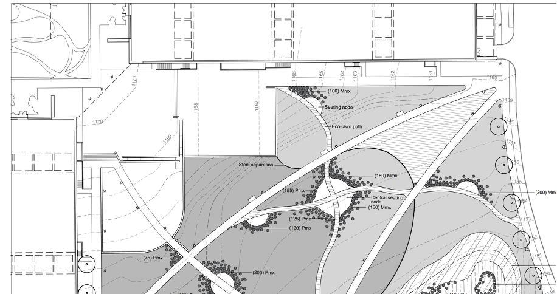

# Module 4b: Technical Plan, Schedules, and Establishment Notes

## Assignment Statement
{#fig-example_journal_entry fig-alt="A technical landscape CAD drawing for the planted meadow ecosystems at Penn State's Millennium Science Center. The overhead plan details an outdoor courtyard bordered by the building on the top and left. It features large, curved planting zones shaded in gray, intersected by straight paths and a curved 'Eco-lawn path'. Key structural features labeled include a 'Seating node', a 'Central seating node', and 'Steel separation' between zones. The planting areas contain specific plant quantity codes such as '(100) Mmx', '(150) Mmx', and '(200) Pmx', with small circles indicating plant placements and larger circles indicating trees along the right edge. Topographic contour lines mark elevations across the site." fig-align="center" width=100%}

### Overview

#### Point Value
30 points

#### Submissions
Note: Due dates are documented within the [course schedule](02_schedule.qmd). 

- One PDF containing a minimum of two pages (likely three pages).

### Introduction
Module 4b calls for preparing a technical, AutoCAD-generated contract document (CD) set for the meadow complex at the Millennium Science Complex. It builds on, refines, and **implements** the meadow mosaic concept and palette you prepared during Module 4b. We remind you again during this module to **pay close attention to the details in the problem statement and instructions provided in class**. 

### Required Components

#### Overall Meadow Complex Technical Criteria
First, the required meadow components from Module 4a are still in effect (refer back to the [Module 4a Assignment Statement Design Guidelines](@sec-mod_4a_design_criteria)). Additionally, the [Planting Goal, Objectives, and Program](@sec-program) provided at the beginning of the semester remain relevant. Ensure you self access if the work you moving forward meets all the previously documented requirements and address any changes that are needed from Module 4a.

Besides transitioning from concept design to technical plan, other technical components required for Module 4b are as follows:

- **You must design your own custom mixes**. No pre-designed ‘off-the-shelf’ commercial mixes are allowed – except for the eco-lawn. An adjustment from the initial palette you designed in module 4a is OK – this is a regular part of design development. Of course, we expect you to respond to the module 4a project evaluations you received.
- Tie each seed mix to your plan's distinct meadow/eco-lawn zones. Except for the soil preparation approach, which applies to all zones, each zone requires different establishment and management approaches. Delineate each unique seeding area using AutoCAD linework, textures/hatches, and labels, and include these graphics in a legend for even greater clarity.
- Remember, designed meadows are mini-grassland ecosystems, with grasses as the matrix or “backbone.” When specifying seed percentages in a mix, aim for 70-80% PLS (“Pure Live Seed” – see Ernst Seed catalog for a definition) of the overall seed mix weight to be graminoids, with the remaining 20-30% PLS being forb seeds. 
- The eco-lawn seed mix will include cool-season, low-growing grasses, mostly fescues (genus: Festuca). These could consist of sheep fescue, chewings fescue, hard fescue, creeping red fescue, or other low-growing, cool-season grasses you listed in Mod. 4a. Additionally, a low-growing legume (e.g., “micro-clover”) is worth considering to enhance biodiversity, resilience, and soil-building.
- Include forb plugs in most meadows to augment seeding and achieve first—and second-year floral accents in high-profile areas or in aesthetically strategic “drifts.” Plugs are not needed in the eco-lawn.
- The Notes part of your CD set will include instructions to the Contractor regarding soil preparation before seeding and plugging, seed and plug quality, timing of planting/seeding, installation techniques, immediate care for the new meadow ecosystem, and longer-term monitoring and management.
- Meadows aren’t instantaneous, so your Notes must communicate an adaptive management approach. **Warm-season grasslands**, especially, can be tricky to establish; allow for a **4-year adaptive management + warranty period. Cool-season grass meadows**, including the Rain Meadow, can be reliably established within a **3-year adaptive management and warranty period**. The Eco-lawn can be quickly established within two growing seasons.
- Late Spring burning as a weed management tool for warm-season grass meadows may be feasible on this site. The alternative would be a special mowing regime called “Spring scalp mowing” that emulates fire ecology (to be discussed in the lecture). Detail your weed control technique in your Meadow Establishment Notes for the meadow areas with warm-season grasses.
- Remember that you may remove one of the concrete cross-paths. Other design criteria from Module 4a will still be expected in Module 4b.
- Carefully integrated pedestrian access and seating within the meadow remain a requirement. Identify existing lamp standards along the concrete walkways; it’s your choice whether lighting is provided on the “side/interior” unpaved pathways.
- Show all the plan-view details possible at a 1”=30’-0” plan scale, along with the required Seeding and Plugging Schedules and Notes to the Contractor. Provide proper labels, a legend, a north arrow, a numerical scale, and a completed technical title block.
- Delineate the extent of the plan's erosion control blanket (“ECB”). Include the technical information on the ECB and associated compostable staples/stakes in the Notes for the Rain Meadow.

#### Meadow Establishment Notes
A complete CD set will always include specific Notes (to the Contractor) on how to install and successfully establish a living installation through the all-important first several years. Thus, your Notes will be arranged in 3 top-level sections:  

1.	Soil Preparation
2.	Seeding, Plugging, and ECB Installation
3.	Extended Warranty and Adaptive Management

Notes communicate what the plan and schedules cannot. In a CD set, they provide exacting, **legal instructions** from the Client’s representative (you, the Landscape Architect) to the Contractor. **Notes shall use imperative word choices** that express a command rather than a statement or a question (applies to both verbs and adverbs). They are so essential that they coexist alongside the Plan drawings and Seeding and Planting Schedules. As mentioned in the lecture, less critical or ‘boilerplate’ written instructions are usually included within a **Specifications booklet (not part of this course)** that makes up part of the overall project bid package provided to Contractors.

Your Notes must advance project design objectives while being brief, clear, and legally valid. They will address:

- **soil preparation before** seeding and plugging
- **seed and plug quality** coming from the seed supplier/nursery
- **timing** of planting/seeding; on-site installation techniques and quality control
- **specification and installation** of erosion control blanket
- **immediate** care for the new meadow ecosystems, and
- **longer-term monitoring and management** through the extended warranty period.

In crafting your Notes, refer to the information provided in:

- the entirety of the problem statement above, plus the Module 4a statement provided earlier 
- your own Module 4a meadow planting strategy and palette
- additional instructions provided during Module 4 lectures; we strongly advise that you take detailed notes
- resource material is provided through Canvas, in the studio, and online.

### Submission Requirements
Drawings must be prepared in AutoCAD with technically accurate, highly legible black-and-white linework and hatch patterns (no color is allowed).

1.	**CAD Planting Plan** 1”=30’-0”, on Arch D size sheet(s) (24”x36”) or larger
    a.	Seeded meadow and eco-lawn patterns, labeled with various meadow/lawn types.
    b.	Forb plugs, either as accents or drifted through the seed matrix to promote more instantaneous color and texture in key areas of the meadow; plug drifts/accents will be labeled and cross-referenced to a Plug Schedule.
    c.	Existing dashed contours and proposed solid line contours (both in gray) for grading associated with Rain Meadow.
    d.	Note which concrete pathway to remove and the soil associated with the sidewalk sub-base to be rehabilitated.
    e.	Use a dashed line to delineate the extent of the ECB.
    f.	Amenities and infrastructure: paths and seating, lighting, level changes and/or associated root barriers when necessary, and below-ground stormwater detention—all labeled. No construction details are required in module 4b, but feel free to add your own if you’re inclined.
    g.	Legend: include meadow/lawn hatches, ECB designation, herbaceous perennial plug symbol, site amenity symbols, and proper labels.
    h.	A numerical scale (do not show graphic scales on construction plans); a north arrow
2.	**Seeding and Plugging Schedules**:  Each meadow area will require a distinct, custom-designed Seeding Schedule. Each sub-zone would need a seeding schedule if your Module 4a concept included meadow sub-zones. A single Plugging Schedule should suffice; however, subcategories may be necessary. Seeding and plugging schedules have fewer columns than the typical Planting Schedule because they don't need keys, size, condition, or remarks. A recommended organization for Seeding and Plugging Schedule columns and rows is as follows:

**[ Name ]  Meadow (or Eco-lawn) Seed Schedule** application rate: __ lbs* PLS per acre.

**Columns**:  ***Scientific Name, Common Name, and % Total Weight for each specie (overall total weight must add up to 100%!***)  [ * typically, recommended seeding rates for WSG/Prairie meadow seed mixes are about 30-35 lbs per acre; CSG/Mesic meadow seed mixes are applied at a rate of 50-70 lbs/acre. For the eco-lawn, Prairie Moon Nursery’s Eco-Grass, for example, is applied at a rate of about 200 lbs./acre]

**Optional**: Integrate graphic keys into the Schedules (pulled from your Legend) to show seeding hatch patterns and plugs.

**Rows** are organized into categories, showing Graminoid and Forb sub-categories, each to be listed in alphabetical order by scientific name. 

**For Forb Plug Schedules**, we suggest the 50-celled “deep plug” tray, e.g. New Moon Nursery’s 4.5-inch DP50 plugs, Northcreek Nursery’s 5-inch LP 50 plug, or similar. Determine plug quantities in multiples of 50 (or whatever your chosen supplier’s standard tray full count is). A simple plugging schedule framework is as follows:

**Columns**:  ***Scientific Name, Common Name, and # Quantity of each species***.

**Rows** listing forb species, in alphabetical order by Scientific Name.
3.	**Extended Warranty, Establishment, and Adaptive Management:  Prepare all notes in Word, and then copy-paste them into your AutoCAD sheet(s)**. **Notes should be numbered and organized into the sections shown below**.  Within each section, you may create sub-sections for your various meadows, since seeding installation techniques and management approaches will differ for the 3 meadow types and the Eco-lawn. A suggested framework is here:

Meadow Establishment Notes

1.	Soil Preparation  
    1.1.	notes here, by type of meadow, including the eco-lawn  
    1.2.	notes on sidewalk remove/rehab., etc.  
2.	Seed and Plug Arrivals and Installation  
    2.1.	notes here, by type of meadow…  
    2.2.	etc.  
3.	Erosion Control Blanket (ECB) Specification and Installation  
    3.1.	notes here…  
    3.2.	more notes here…etc.  
4.	Extended Warranty and Adaptive Management  
    4.1.	Prairie Meadow, Years 1-4  
&nbsp;&nbsp;&nbsp;&nbsp;&nbsp;&nbsp;4.1.1.	notes…  
&nbsp;&nbsp;&nbsp;&nbsp;&nbsp;&nbsp;4.1.2.	etc.  
    4.2.	Mesic Meadow, Years 1-3  
&nbsp;&nbsp;&nbsp;&nbsp;&nbsp;&nbsp;4.2.1.	notes…  
&nbsp;&nbsp;&nbsp;&nbsp;&nbsp;&nbsp;4.2.2.	etc.  
    4.3.	Rain Meadow and Erosion Control Blanket, Years 1-3  
&nbsp;&nbsp;&nbsp;&nbsp;&nbsp;&nbsp;4.3.1.	notes…  
&nbsp;&nbsp;&nbsp;&nbsp;&nbsp;&nbsp;4.3.2.	etc. (be sure to specify ECB+staple type, supplier, and installation details)  
    4.4.	Eco-lawn (or Eco-turf, etc.), Years 1-2  
&nbsp;&nbsp;&nbsp;&nbsp;&nbsp;&nbsp;4.4.1.	notes…  
&nbsp;&nbsp;&nbsp;&nbsp;&nbsp;&nbsp;4.4.2.	etc.  

### Evaluation Rubric
I provided detailed evaluation criteria in @tbl-mod4b_eval. 

| Description | Value |
|:-------------|:-----:|
| **Plan**|                  |
| meadow and eco-lawn layout and details are sensitive to site conditions, ecologically robust, aesthetically appealing, functional, and safe | 2 points |
| plugs are used effectively in critical areas to augment seeded areas | 2 points |
| path layout and seating nodes are well-integrated and promote project objectives | 2 points |
| adherence to problem statement requirements  | 2 points |
| **Seeding & Plugging Schedules**|                  |
| seed and plug mixes are diverse, balanced, and appropriate for their specific meadow or eco-lawn type; no invasive or inappropriate selections, and fit within our 6b/7a plant hardiness zone; all plants must be native to the Mid-Atlantic or the upper Midwest (e.g., Ohio, Illinois, Indiana, etc.) | 4 points |
| proper plant nomenclature and spelling, drawn from USDA Plants (online), Rhoads’ Vascular Flora of Pennsylvania, or the Lady Bird Johnson Wildflower Center online. | 4 points |
| **Establishment and Management Notes**|                  |
| content promotes design intentions and project goals and is technically correct, complete, and precise | 2 points |
| redundant or extraneous instructions to the Contractor are avoided | 3 points |
| writing is complete, concise, and clear, and in “contract style” (in the imperative) | 3 points |
| **Overall communication**|                  |
| overall sheet layout is appealing, neat, and legible, including the technical title block | 6 points |

: Module 4a evaluation rubric. {#tbl-mod4b_eval}

### References

First, see faculty lectures (PDFs) on Canvas. Because there are so many details – some provided only verbally – **it’s imperative that you take notes**. See our lectures and the Establishment Guide in Ernst Seeds’ catalog for soil tillage strategies.

[https://www.prairienursery.com/resources-and-guides/seeds-and-seed-mixes/](https://www.prairienursery.com/resources-and-guides/seeds-and-seed-mixes/){target="_blank"}

In addition, for the Prairie Meadow, see also Prairie Nursery’s “See Mix Establishment Guide” at:  
[https://www.prairienursery.com/resources-and-guides/seeds-and-seed-mixes/](https://www.prairienursery.com/resources-and-guides/seeds-and-seed-mixes/){target="_blank"}  
(you will have to pick and choose notes, and convert to ‘technical’ language)

For Mesic Meadow establishment, see lecture notes and Ernst Seed’s guidelines at:  
[https://www.ernstseed.com/resources/planting-guides/woodland-opening-planting-guide/](https://www.ernstseed.com/resources/planting-guides/woodland-opening-planting-guide/){target="_blank"}

For Rain Meadow establishment, see lecture notes and Ernst Seed’s guidelines at:  
[https://www.ernstseed.com/resources/planting-guides/wet-meadows-wetlands-planting-guide/](https://www.ernstseed.com/resources/planting-guides/wet-meadows-wetlands-planting-guide/){target="_blank"}

Find your own ECB and staple supplier; ECB should be rated “Short Term” (1 year, or at least one full growing season).

For the Eco-Lawn, see lecture notes and Prairie Nursery’s web page at:  
[https://www.prairiemoon.com/eco-grass](https://www.prairiemoon.com/eco-grass){target="_blank"}  

(species mix is here:  
[https://www.prairienursery.com/no-mow-lawn-seed-mix.html](https://www.prairienursery.com/no-mow-lawn-seed-mix.html){target="_blank"})  

or an equally good alternative such as:  
[https://www.prairienursery.com/media/pdf/no-mow-fact-sheet.pdf](https://www.prairienursery.com/media/pdf/no-mow-fact-sheet.pdf){target="_blank"}  

## Lectures
[Planted Meadow Ecosystems: Notes to the Contractor/Site Preparation and Soils](https://pennstateoffice365-my.sharepoint.com/:b:/g/personal/tlf159_psu_edu/IQB4XrrBm1VkRJbt2s-pUNj1Acu-6kLCS3tKLRJD9YSm-1I?e=pw6fo0){target="_blank"}

[Planted Meadow Ecosystems: Installing Seeds & Plugs, Adaptive Management](https://pennstateoffice365-my.sharepoint.com/:b:/g/personal/tlf159_psu_edu/IQD7erg0xYAuT5FMRs59um3vAdS9l1bHYD-cLWYWVgYrjR4?e=OBlKrm){target="_blank"}

[Meadow Construction Documents: Layout and AutoCAD Techniques](https://pennstateoffice365-my.sharepoint.com/:b:/g/personal/tlf159_psu_edu/IQDZVuW8CC1JQIaowYcYdKbKAZB8kAi7SgOZbCvBbIjAmpk?e=HwJl5P){target="_blank"}