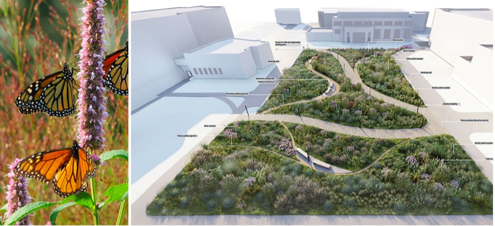

```{r}
#| label: setup
#| include: false
current_year <- format(Sys.Date(), "%Y")
```

{fig-alt="Composite image showing monarch butterflies feeding on pink flower spikes beside a landscape design rendering of a curving pollinator garden with winding paths, dense native planting beds, benches, and labeled site features."}

# Syllabus {.unnumbered}

## Course Information

### Meeting Times
Tuesday and Thursday, 9:05 - 11:50 AM

### Location(s)
144 Stuckeman Family Building
<br>

```{r class room map}
#| warning: false
#| echo: false
#| message: false

# call and run script for class room building location
source("boilerplate/00_classroom_map.R")

map_classroom
```

<br> 
Outdoors: Millennium Science Complex

### Faculty

Travis Flohr, Ph.D., [tlf159\@psu.edu](mailto:tlf159@psu.edu), 419 SFB, office hours by appointment.

### Instructor
Mohammad “Mo” Rezvan, [mfr5731\@psu.edu](mailto:mfr5731@psu.edu), Office hours and location by appointment.

### Teaching Assistant

Paige Groton, [peg5127\@psu.edu](mailto:peg5127@psu.edu), Office hours and location by appointment.

### Undergraduate Assistant
Derek Pei, [dqp5484\@psu.edu)](mailto:dqp5484@psu.edu), Office hours and location by appointment.

### Credits
Larch 335: 3 credits
Larch 837: 3 credits

### Course Costs and Materials
We have tried to keep course costs to a minimum. Feel free to leverage your existing supplies (e.g., pens, pencils, erasers, and pencil sharpeners). Still, @tbl-course_costs is our best estimate of course costs based on past course experiences. You may use markers or pens other than those listed below; the key is being able to produce the work that is required of you. However, note that exact costs may vary depending on the extent of your plant lists when printing for review. You may use markers or pens than other from those listed below; the key is to quickly create conceptual drawings with three to four distinctly different line weights. 

| Materials and Supplies                          | Total Costs |
|:------------------------------------------------|-------:|
| *Materials and Supplies*                          |        |
| Field Journal                                   | $25.00 |
| Fine liner Technical Pens or Sharpies            | $15.00 |
| Graphite Pencil Set, with multiple (3+) hardness's| $10.00 |
| Pencil Sharpener                                | $2.00  |
| 1 rol of 24" trace                              | $20.00 |
| *Printing*                                      |        |
| 11” x 17” (Tabloid) Black and White Plant Lists, 20 sheets (single-sided) * $0.17 | $3.40 |
| 24” x 26” (Arch D) Black and White Base Maps, 2 sheets (single-sided) * $18.00 | $36.00 |
| ***Total Costs***                               | ***$111.40*** |

: Estimated course costs. {#tbl-course_costs}

** Disclaimer. Prices are as accurate as those provided in the summer of Published in `{r} current_year`.

Please feel free to express yourself artistically with supplies other than those listed above.

#### Software
Although Larch 335/837 will emphasize integrating a wide array of software tools to represent the design and implementation process, the base information and construction drawings will be created using AutoCAD. Implementing landscape projects requires creating planting contract documents with symbols, labels, notes, details, and plant schedules. In addition to developing your digital drafting skills, you will use AutoCAD to manage sheet sets, generate plant schedules from dynamic block attributes, link to external spreadsheets, and embed external objects.	

However, effective visual thinking and communication are essential to any design and implementation process, especially planting design and implementation. As you learn and apply planting design principles and techniques, you will also learn and apply various visualization and representation techniques. In addition to freehand sketching and rendering, you may use SketchUp or Rhino to create three-dimensional models to explore compositional possibilities and plant-landscape-people relationships. For more detailed studies, you may create photorealistic montages in Photoshop or photorealistic renderings using Twinmotion or Lumion, to name a few. We also support analog techniques (e.g., watercolor, markers) to recognize the diversity of traditions and objectives in design representation. Regardless of the technology or technique you choose, we expect your design representation to meet the assignment requirements and be of high quality. Please note that all the software used in this course is free to download on your personal computers or in one of the computer labs in the Stuckeman Family Building. 

#### Personal Technology
This course requires extensive computer work that sometimes builds on previous projects throughout the semester. Lost data due to hard drive crashes, accidental deletions, corruption, etc., is bound to happen; however, the student must ensure they have backup copies of their work. Students should use their existing external hard drive or flash drive when working on personal, lab, or loaner computers, and maintain a working and a backup copy of all files when working on university-owned machines via remote access. We will cover strategies for backing up your data on the first day of class. We recommend backing up your data at least once per week.

If you already have an external hard drive or USB flash drive, feel free to continue using it as long as you have enough free space for it to work. We recommend purchasing at least a 1 TB Drive with a USB 3 connection if you need a hard drive. Your drive must be formatted for Windows. If you have questions regarding these requirements, please ask. Your previous drives from Larch 216/816 should be sufficient.


## Course Description and Objectives

Larch 335/837 Planting Methods is part of the core professional sequence of our accredited BLA and MLA programs. As a **methods** course, it complements the design studio sequence by providing an applied focus on plants and the implementation of plantings in designed landscapes. It also serves as a setting to apply knowledge gained during Larch 145 and 245 (Ecology & Plants I and II), Larch 246 (Ridge & Valley), and other 'planterly' content in your prior design studios. Of course, we expect that Larch 335 (BLAs) and 837 (MLAs) will inform your design studio work this semester and in the following ones.

Knowledge of plants and plant culture and skill in planting design and implementation are critical aspects of the landscape architect's education. Why? Because plants immensely contribute to sustaining and enhancing life in all forms. Well-selected, located, and managed landscape plants **perform** [^1]. As landscape architects, we have the responsibility and privilege of helping to place these benefits in motion.

[^1]: **Landscape performance** is “a measure of the effectiveness with which landscape solutions fulfill their intended purpose and contribute to sustainability. It involves assessment of progress toward environmental, social, and economic goals based on measurable outcomes (Landscape Architecture Foundation, 2024).”

This course aims to develop your appreciation of plants in the landscape while advancing knowledge and skills in applied planting techniques, documentation, and management protocols as distinct yet integral components of the landscape design and stewardship process. In terms of outcomes, by the end of the semester, you will have:

1.	gained experience in the horticulture and 'ecoculture' of established and emerging planting genres—the mixed pollinator garden, treed urban plaza, meadow, and hydric habitats, and other planted landscape contexts;
2.	built technical abilities in species selection, planting establishment and soil improvement methods, planting installation details, and adaptive management of the planted landscape;
3.	gained fluency in contract documentation (CD) that accurately and clearly communicates project intents and standards to contractors and managers; 
4.	bolstered your understanding of progressive planting design theory that addresses aesthetic, ecological, cultural, and functional factors; 
5.	became aware of some of the performative aspects of planted landscapes in contributing to local-scale sustainability and resilience;
6.	considered diversity, equity, inclusion, and belonging (DEIB) aspects of planting design and planterly built works; and
7.	continued to develop your skills in AutoCAD and related digital media for conceptualization, visualization, and contractor instructions

### Planterly, Cultural, and Professional Diversity 

There's a growing body of scholarship that modern students are learning less and less about plants and plant communities, which are the foundation of sustainable human societies and a big part of what we envision when we think of the beauty of the natural world (Wandersee & Schussler, 1999). We hope this course plays a role in ensuring the next generation of landscape architects are **nature literate** and that our profession helps reverse broader societal trends toward **plant blindness** and **biodiversity collapse** (Brzuszek et al., 2011; Griswold, 1994; Sturtevant, 1927; Weller, 2014).

The gardenesque, culinary, and medicinal uses of plants have underpinned many distinct cultures and traditions across diverse societies, not just amongst privileged classes of European background. We hope this course provides an opportunity to explore the close links between horticulture and human culture, particularly in underappreciated black and brown communities. George Washington Carver (c. 1864-1943) was one of the most prominent botanists of the early 20th century, having discovered hundreds of uses for native and introduced plants across the U.S. David Augustus Williston (1868-1962) was an esteemed landscape architect and horticulturist on many important U.S. campus design projects. More recently, many minority-led design firms have been pushing the boundaries of planting design and methods in contemporary landscape architecture. We think of the outstanding work on the Highline plantings by Isabel Castilla of James Corner Field Operations; the many culturally-attuned and inclusive landscapes by Walter Hood and company; José Almiñana's work with Andropogon on Phipps Conservatory's Center for Sustainability, and the award-winning projects of New York-based garden designer, Wambui Ippolito. The list could go on. Throughout the semester, let's look for opportunities to embrace human and professional diversity associated with planting design and methods.

We should scrutinize botanical terminology with negative connotations to support our College's diversity, equity, and inclusion (DEI) policies. Let's begin by embracing Penn State Arboretum's position on the issue:

>"Derogatory Terminology in Common Names and Taxonomy: The fields of botany and horticulture [and landscape architecture] have not been immune to the biases and prejudices of the larger culture. This sad and frustrating fact becomes immediately evident when we are confronted with blatantly racist or pejorative common names for plants. Such pejorative terminology is inconsistent with Penn State's values, as well as with the professional standards of the public horticulture field. The Arboretum at Penn State [and us in Larch 335/837] will not knowingly use or promote derogatory, biased, or racist common names in any of its publications or educational materials (citation unknown)."

## Course Outcomes
Upon completion of Larch 335/837, you should be able to:

- conduct site and local context analyses that inform planting design and implementation;
- conduct independent technical research and integrate it within the larger scope of a planting strategy;
- develop planting concepts based on given goals and programs that interweave social, aesthetic, ecological, and utilitarian objectives;
- apply an integrated approach to using hand drawing, AutoCAD, SketchUP, or Rhino, and Twinmotion or Lumion visualization software to communicate planting approaches and plant choices effectively;
- develop woody and herbaceous plant palettes and follow-up technical CAD plant schedules;
- prepare detailed and accurate technical CAD planting and seeding plans, as well as associated site layout plans that meet performative standards for sustainable landscapes;
- prepare progressive technical planting details;
- craft instructions to the Contractor regarding site preparation, soil remediation and enhancement, plant procurement, planting, seeding, and landscape management during the plant establishment period, and;
- generate technically thorough, well-organized, and succinct CAD contract documents.

Although the final design and planting implementation are exacting and technical, your projects will maintain a commitment to the site's overall goals and solid design (aesthetic, ecological, inclusive social, and functional) principles and performance standards throughout the process. 

## Course Structure 
Learning theory strongly advises blending several approaches to build knowledge. As such we will interweave multiple learning formats: site visits, lectures, demonstrations, workshops, pin-ups, and one-on-one desk critiques. 

## Evaluation and Grade Allocation
This course has a total of four main modules with two modules having sub modules, details are provided below @tbl-module_values. Details for each graded deliverable will be provided within individual deliverable statements.

### Larch 335/837

| Module                             | Value            |
|:-----------------------------------|:-----------------|
| ***Module 1: Site Analyses***                     | 10 points        |
| ***Module 2: Pollinator Garden***                 |                  |
| 2a. Pollinator Garden Plant List/Design Check-off | 15 points        |
| 2b. Pollinator Garden Technical Planting Plan/Schedule | 30 points   |
| ***Module 3. Technical Treed Plaza Plan and Details*** | 60 points   |
| ***Module 4. Planted Meadow Ecosystems***              |             |
| 4a. Meadow Concept and Palette                         | 30 points   |
| 4b. Technical Meadow Plan, Schedules, and Establishment Notes | 30 points|
| Engagement - steady participation, progress, attendance, and preparation| 10 points |
| ***Total***                                            | ***185 points*** |

: Outline of course modules and their associated point values. {#tbl-module_values}

### Larch 837 Enrichment
We expect graduate students to participate in 800-level courses and engage with the content. Graduate course content will include advanced-level exploration of the technical content covered in Modules 2 and 4. The specific deliverable will be a cost estimate spreadsheet and an associated design and cost presentation to the undergraduate class. Each cost estimate and presentation will be worth 10 points, making Larch 837 worth 205 points. 

### Grading Rubric and Scale
<!-- 00_grading_scale.qmd -->



## Course Policies

### AI/Generative Technology Policy
<!-- 00_ai_no_policy.qmd -->



<!-- 00_policies_resources.qmd -->



## References
Brzuszek, R. F., Harkess, R. L., & Stortz, E. (2011). Perceptions of the Importance of Plant Material Knowledge by Practicing Landscape Architects in the Southeastern United States. HortTechnology, 21(1), 126–130. https://doi.org/10.21273/HORTTECH.21.1.126 

Griswold, M. (1994). The Horticultural Reconnection. Landscape Architecture Magazine, 84(5), 46–48, 50, 52.

Landscape Architecture Foundation. (2024). About Landscape Performance | Landscape Performance Series. https://www.landscapeperformance.org/about-landscape-performance

Penn State University. (2024). Academic Integrity | Penn State. Undergraduate Bulletin. https://bulletins.psu.edu/undergraduate/general-information/academic-information/student-rights-responsibilities/academic-integrity/

Sturtevant, R. S. (1927). Planting design—Its study and teaching. Landscape Architecture Magazine, 18(1), 52–59.

Wandersee, J. H., & Schussler, E. E. (1999). Preventing Plant Blindness. The American Biology Teacher, 61(2), 82–86. https://doi.org/10.2307/4450624

Weller, R. (2014). Stewardship now? Reflections on landscape architecture’s Raison d’etre in the 21st century. Landscape Journal, 33(2), 85–108.

